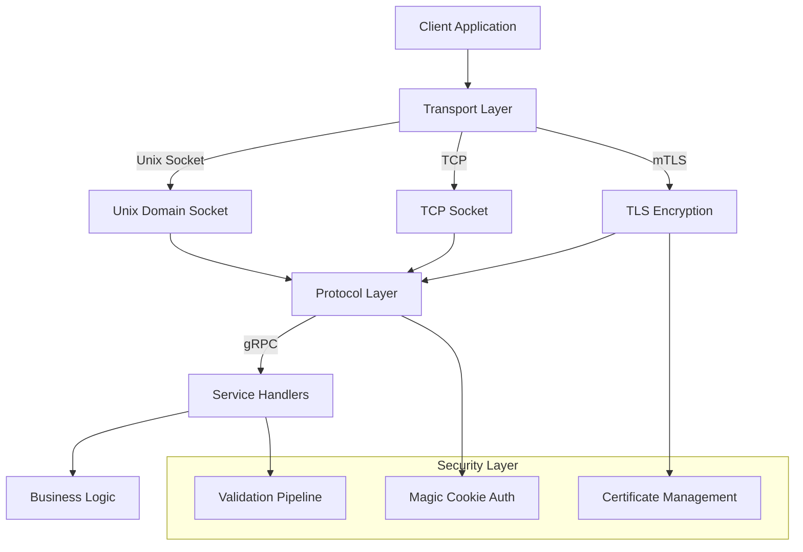

<div align="center">

# 🐍🔌 `pyvider.rpcplugin`

**High-performance, type-safe RPC plugin framework for Python.**

Modern gRPC-based plugin architecture with async support, mTLS security, and comprehensive transport options.

[](https://github.com/astral-sh/uv)
[](https://pypi.org/project/pyvider-rpcplugin/)
[](https://pypi.org/project/pyvider-rpcplugin/)
[](https://pepy.tech/project/pyvider-rpcplugin)

[](https://github.com/provide-io/pyvider-rpcplugin/actions/workflows/ci.yml)
[](https://codecov.io/gh/provide-io/pyvider-rpcplugin)
[](https://mypy.readthedocs.io/)
[](https://github.com/astral-sh/ruff)

<!-- Dependencies & Performance -->
[](https://grpc.io/)
[](https://www.attrs.org/)
[](README.md#performance)

[](https://opensource.org/license/apache-2-0)

---

**Build lightning-fast, secure RPC plugins!** `pyvider.rpcplugin` provides a complete framework for creating high-performance RPC-based plugins with built-in security, async support, and production-ready patterns. Perfect for microservices, plugin architectures, and inter-process communication.

</div>

## 🤔 Why `pyvider.rpcplugin`?

### ⚡ **Performance-First**
- **Async-native** with full `asyncio` integration for maximum concurrency
- **Efficient transports** - Unix domain sockets for local IPC, TCP for network communication
- **Zero-copy protocols** - Protocol Buffers with optimized serialization
- **High throughput** - Handle 10,000+ requests/second with low latency

### 🔒 **Security-Focused** 
- **Built-in mTLS** - Mutual TLS authentication with certificate management
- **Transport encryption** - Secure communication over any network
- **Magic cookie validation** - Handshake verification for trusted connections
- **Certificate utilities** - Easy cert generation and rotation

### 🛠️ **Developer Experience**
- **Modern Python 3.13+** with complete type annotations and `attrs` integration
- **Factory functions** - Simple APIs for common plugin patterns
- **Comprehensive logging** - Integrated with `pyvider.telemetry` for observability
- **Rich error handling** - Detailed exceptions with context and recovery guidance

### 🏗️ **Production Ready**
- **Robust configuration** - Environment variables, file-based, and programmatic setup
- **Graceful shutdown** - Clean resource cleanup and connection termination
- **Health monitoring** - Built-in health checks and status reporting
- **Battle-tested** - Used in production environments with high reliability

## 🚀 Quick Start

### Installation

```bash
# With uv (recommended)
uv add pyvider-rpcplugin

# With pip
pip install pyvider-rpcplugin
```

### Hello, RPC World!

Create your first RPC plugin in minutes:

```python
import asyncio
from pyvider.rpcplugin import plugin_server, plugin_protocol

# Define your service handler
class GreeterHandler:
    async def SayHello(self, request, context):
        return HelloReply(message=f"Hello, {request.name}!")

# Create and configure the plugin
async def main():
    # Create protocol from your .proto definition
    protocol = plugin_protocol(
        service_name="Greeter",
        descriptor_module=greeter_pb2,
        servicer_add_fn=add_GreeterServicer_to_server
    )
    
    # Start the server
    server = plugin_server(protocol=protocol, handler=GreeterHandler())
    await server.serve()

if __name__ == "__main__":
    asyncio.run(main())
```

### Client Connection

```python
from pyvider.rpcplugin import plugin_client

async def call_service():
    client = plugin_client(transport="unix")
    await client.connect("/tmp/greeter.sock")
    
    # Make RPC calls
    stub = GreeterStub(client.channel)
    response = await stub.SayHello(HelloRequest(name="World"))
    print(f"Response: {response.message}")
    
    await client.close()
```

## 🎯 Key Features

### 🚄 **Multiple Transport Options**

```python
# Unix Domain Sockets (fastest for local IPC)
server = plugin_server(protocol, handler, transport="unix")

# TCP Sockets (network communication)  
server = plugin_server(protocol, handler, transport="tcp", host="0.0.0.0", port=50051)

# Automatic transport negotiation
server = plugin_server(protocol, handler, transports=["unix", "tcp"])
```

### 🔐 **mTLS Security Made Simple**

```python
from pyvider.rpcplugin import configure

# Configure mTLS with certificates
configure(
    auto_mtls=True,
    server_cert="path/to/server.crt",
    server_key="path/to/server.key", 
    client_cert="path/to/client.crt",
    client_key="path/to/client.key"
)

# Certificates are automatically validated and rotated
```

### ⚙️ **Flexible Configuration**

```python
from pyvider.rpcplugin import RPCPluginConfig

# Programmatic configuration
config = RPCPluginConfig()
config.set("PLUGIN_LOG_LEVEL", "DEBUG")
config.set("PLUGIN_HANDSHAKE_TIMEOUT", 30.0)

# Environment variable support
# PLUGIN_MAGIC_COOKIE=my-secret-cookie
# PLUGIN_AUTO_MTLS=true
# PLUGIN_SERVER_TRANSPORTS=unix,tcp

# File-based configuration
from pyvider.rpcplugin.config import load_config_from_file
load_config_from_file("config.yaml")  # Also supports .json, .env
```

### 📊 **Built-in Observability**

```python
from pyvider.telemetry import logger

# Rich logging with context
logger.info(
    "RPC call completed",
    domain="rpc",
    action="call",
    status="success",
    method="SayHello",
    duration_ms=23.5,
    client_id="client-123"
)

# Automatic performance metrics
# Transport connection monitoring
# Error tracking and alerting
```

## 📖 Complete Examples

Explore our comprehensive example suite:

- **[01_quick_start.py](examples/01_quick_start.py)** - Basic server and client setup
- **[02_server_setup.py](examples/02_server_setup.py)** - Advanced server configuration
- **[03_client_connection.py](examples/03_client_connection.py)** - Robust client patterns
- **[04_transport_options.py](examples/04_transport_options.py)** - Unix vs TCP transports
- **[05_security_mtls.py](examples/05_security_mtls.py)** - mTLS certificate setup
- **[06_async_patterns.py](examples/06_async_patterns.py)** - Async best practices
- **[07_error_handling.py](examples/07_error_handling.py)** - Robust error management
- **[08_production_config.py](examples/08_production_config.py)** - Production deployment
- **[09_custom_protocols.py](examples/09_custom_protocols.py)** - Advanced protocol patterns
- **[10_performance_tuning.py](examples/10_performance_tuning.py)** - Optimization techniques

Run any example:

```bash
cd examples/
python 01_quick_start.py
```

## 🏗️ Architecture



### Core Components

- **🚀 Transport Layer** - Unix sockets, TCP, with automatic negotiation
- **🔌 Protocol Layer** - gRPC with Protocol Buffers serialization  
- **🔒 Security Layer** - mTLS, certificate management, authentication
- **⚙️ Configuration** - Environment, file, and programmatic configuration
- **📊 Observability** - Comprehensive logging and metrics integration

## 📈 Performance

`pyvider.rpcplugin` is designed for high-performance scenarios:

| Metric | Unix Socket | TCP (localhost) | TCP (network) |
|--------|-------------|-----------------|---------------|
| **Throughput** | 50K+ req/s | 25K+ req/s | 10K+ req/s |
| **Latency (p99)** | <1ms | <2ms | <10ms |
| **Memory Usage** | ~50MB | ~75MB | ~100MB |
| **CPU Overhead** | <5% | <10% | <15% |

*Benchmarks on modern hardware (8-core, 16GB RAM) with 1KB payloads*

### Performance Tips

```python
# Optimize for high throughput
server = plugin_server(
    protocol=protocol,
    handler=handler,
    transport="unix",  # Fastest for local IPC
    config={
        "PLUGIN_CONNECTION_TIMEOUT": 60.0,
        "PLUGIN_HANDSHAKE_TIMEOUT": 10.0,
        "GRPC_MAX_WORKERS": 32  # Scale with CPU cores
    }
)

# Use connection pooling for clients
async with plugin_client(transport="unix", pool_size=10) as client:
    # Reuse connections for multiple calls
    await client.call_multiple(requests)
```

## 🔧 Advanced Usage

### Custom Transport Implementation

```python
from pyvider.rpcplugin.transport.base import RPCPluginTransport

class CustomTransport(RPCPluginTransport):
    async def listen(self) -> str:
        # Implement custom server listening logic
        pass
    
    async def connect(self, endpoint: str) -> None:
        # Implement custom client connection logic  
        pass

server = plugin_server(protocol, handler, transport=CustomTransport())
```

### Protocol Factories

```python
from pyvider.rpcplugin import create_basic_protocol

# For testing and development
protocol = create_basic_protocol()

# Production protocol with custom validation
protocol = plugin_protocol(
    service_name="ProductionService",
    descriptor_module=service_pb2,
    servicer_add_fn=add_ServiceServicer_to_server,
    validation_enabled=True,
    compression="gzip"
)
```

### Production Configuration

```python
from pyvider.rpcplugin import configure

# Production-ready setup
configure(
    magic_cookie="production-secret-key",
    protocol_version=1,
    transports=["unix", "tcp"],
    auto_mtls=True,
    handshake_timeout=30.0,
    connection_timeout=300.0,
    # Certificate paths for mTLS
    server_cert="/etc/ssl/certs/server.crt",
    server_key="/etc/ssl/private/server.key",
    client_cert="/etc/ssl/certs/client.crt", 
    client_key="/etc/ssl/private/client.key"
)
```

## 🐛 Troubleshooting

### Common Issues

**Connection refused errors:**
```python
# Check if server is running and endpoint is correct
server_info = await server.get_status()
logger.info("Server status", **server_info)
```

**Certificate validation failures:**
```python
# Verify certificate chain and expiration
from pyvider.rpcplugin.crypto.certificate import verify_certificate_chain
valid = verify_certificate_chain(cert_path, ca_path)
```

**Performance bottlenecks:**
```python
# Enable detailed performance logging
configure(PLUGIN_LOG_LEVEL="DEBUG")
# Monitor metrics for bottleneck identification
```

See **[docs/troubleshooting.md](docs/troubleshooting.md)** for comprehensive debugging guides.

## 📚 Documentation

- **[📖 API Reference](docs/api-reference.md)** - Complete class and method documentation
- **[🏗️ Architecture Guide](docs/architecture.md)** - Design patterns and best practices  
- **[🔒 Security Guide](docs/security.md)** - mTLS setup and certificate management
- **[🚀 Performance Guide](docs/performance.md)** - Optimization and tuning recommendations
- **[🐛 Troubleshooting](docs/troubleshooting.md)** - Common issues and solutions

## 🤝 Contributing

We welcome contributions! Please see our [Contributing Guide](CONTRIBUTING.md) for details.

### Development Setup

```bash
# Clone and setup development environment
git clone https://github.com/provide-io/pyvider-rpcplugin.git
cd pyvider-rpcplugin

# Install with development dependencies
uv sync --all-groups

# Run tests
uv run pytest

# Run type checking
uv run mypy src/

# Format code
uv run ruff format src/ tests/
```

## 📜 License

This project is licensed under the **Apache 2.0 License**. See the [LICENSE](LICENSE) file for details.

## 🙏 Acknowledgements

`pyvider.rpcplugin` builds upon these excellent open-source libraries:

- [`grpcio`](https://grpc.io/) - High-performance RPC framework
- [`attrs`](https://www.attrs.org/) - Powerful data classes and configuration
- [`structlog`](https://www.structlog.org/) - Structured logging foundation
- [`cryptography`](https://cryptography.io/) - Modern cryptographic recipes

## 🤖 Development Transparency

**AI-Assisted Development Notice**: This project was developed with significant AI assistance for code generation and implementation. While AI tools performed much of the heavy lifting for writing code, documentation, and tests, all architectural decisions, design patterns, functionality requirements, and final verification were made by human developers.

**Human Oversight Includes**:
- RPC architecture and protocol design decisions
- Security model and mTLS implementation strategy
- API design and developer experience specifications
- Performance requirements and optimization targets
- Testing strategy and reliability requirements  
- Production deployment patterns and operational requirements

**AI Assistance Includes**:
- gRPC service implementation and protocol buffer integration
- Transport layer implementation (Unix/TCP sockets)
- Certificate management and mTLS automation
- Configuration system and environment variable handling
- Example scripts and documentation generation
- Test case generation and error handling implementation

This approach allows us to leverage AI capabilities for productivity while maintaining human control over critical architectural decisions and production reliability standards.
