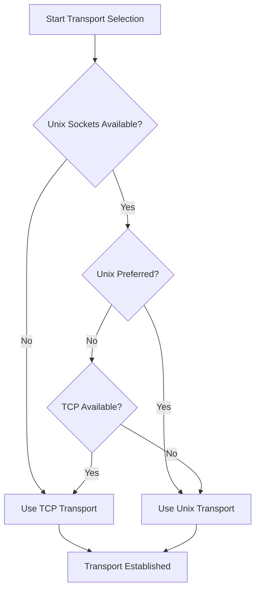

# Transport API

The Transport API provides network communication abstractions for plugin-to-host connections. It supports Unix domain sockets and TCP sockets with automatic transport negotiation.

## Core Classes

### RPCPluginTransport (Abstract Base)

Abstract base class defining the transport interface:

```python
from pyvider.rpcplugin.transport.base import RPCPluginTransport

class CustomTransport(RPCPluginTransport):
    async def listen(self) -> str:
        """Start listening and return connection endpoint."""
        pass
    
    async def connect(self, endpoint: str):
        """Connect to the given endpoint."""
        pass
    
    async def close(self):
        """Close the transport."""
        pass
```

### UnixSocketTransport

High-performance Unix domain socket transport for local IPC:

```python
from pyvider.rpcplugin.transport import UnixSocketTransport
import tempfile

# Automatic path generation
transport = UnixSocketTransport()

# Custom path
transport = UnixSocketTransport(path="/tmp/my-plugin.sock")

# Use with temporary file
with tempfile.NamedTemporaryFile(suffix=".sock", delete=False) as tmp:
    transport = UnixSocketTransport(path=tmp.name)
```

**Features:**
- **Automatic Path Generation** - Creates unique socket paths
- **Permission Management** - Configurable socket file permissions
- **Cleanup Handling** - Automatic socket file removal
- **Collision Detection** - Handles path conflicts gracefully

### TCPSocketTransport

Network-capable TCP socket transport:

```python
from pyvider.rpcplugin.transport import TCPSocketTransport

# Localhost with auto-assigned port
transport = TCPSocketTransport()

# Specific host and port
transport = TCPSocketTransport(host="127.0.0.1", port=8080)

# Auto-assign port (port=0)
transport = TCPSocketTransport(host="0.0.0.0", port=0)
```

**Features:**
- **Automatic Port Assignment** - OS selects available ports
- **Host Binding Control** - Bind to specific interfaces
- **Port Range Management** - Configurable port ranges
- **IPv4/IPv6 Support** - Dual-stack networking

## Transport Selection

### Automatic Negotiation

Transports are automatically selected based on platform capabilities and configuration:



### Configuration-Based Selection

```python
from pyvider.rpcplugin import configure

# Prefer Unix, fallback to TCP
configure(server_transports=["unix", "tcp"])

# TCP only (e.g., Windows)
configure(server_transports=["tcp"])

# Unix only (high security)
configure(server_transports=["unix"])
```

### Environment Variables

```bash
# Transport priority
export PYVIDER_RPC_SERVER_TRANSPORTS="unix,tcp"

# Unix socket configuration
export PYVIDER_RPC_UNIX_SOCKET_PATH="/var/run/my-app/plugin.sock"
export PYVIDER_RPC_UNIX_SOCKET_PERMISSIONS="0600"

# TCP configuration
export PYVIDER_RPC_TCP_HOST="127.0.0.1"
export PYVIDER_RPC_TCP_PORT="0"  # Auto-assign
export PYVIDER_RPC_TCP_PORT_RANGE="8000-9000"
```

## Platform Support

### Linux

Full support for both transport types:

```python
# Optimal Linux configuration
configure(
    server_transports=["unix", "tcp"],  # Unix preferred
    unix_socket_path="/var/run/myapp/plugin.sock",
    tcp_host="127.0.0.1"
)
```

### macOS

Full support for both transport types:

```python
# Optimal macOS configuration
configure(
    server_transports=["unix", "tcp"],  # Unix preferred
    unix_socket_path="/tmp/myapp-plugin.sock",
    tcp_host="127.0.0.1"
)
```

### Windows

TCP sockets only (Unix socket support planned):

```python
# Windows configuration
configure(
    server_transports=["tcp"],
    tcp_host="127.0.0.1",
    tcp_port=0  # Auto-assign
)
```

## Unix Socket Transport

### Path Management

```python
transport = UnixSocketTransport()

# Get the socket path
socket_path = transport.path
print(f"Socket will be created at: {socket_path}")

# Custom path with validation
import os
custom_path = "/tmp/my-plugin.sock"
if os.path.exists(custom_path):
    os.unlink(custom_path)  # Remove stale socket

transport = UnixSocketTransport(path=custom_path)
```

### Permission Control

```python
# Restrictive permissions (owner only)
transport = UnixSocketTransport(
    path="/tmp/secure-plugin.sock",
    permissions=0o600  # Owner read/write only
)

# Group access
transport = UnixSocketTransport(
    path="/var/run/app/plugin.sock", 
    permissions=0o660  # Owner and group read/write
)
```

### Directory Management

```python
import os
from pathlib import Path

# Ensure directory exists
socket_dir = Path("/var/run/myapp")
socket_dir.mkdir(parents=True, exist_ok=True)
socket_dir.chmod(0o755)

transport = UnixSocketTransport(
    path=str(socket_dir / "plugin.sock"),
    permissions=0o600
)
```

## TCP Socket Transport

### Host Binding

```python
# Localhost only (secure)
transport = TCPSocketTransport(host="127.0.0.1", port=0)

# All interfaces (caution: network exposure)
transport = TCPSocketTransport(host="0.0.0.0", port=8080)

# Specific interface
transport = TCPSocketTransport(host="192.168.1.100", port=8080)

# IPv6
transport = TCPSocketTransport(host="::", port=8080)  # All IPv6 interfaces
transport = TCPSocketTransport(host="::1", port=8080)  # IPv6 localhost
```

### Port Management

```python
# Automatic port assignment
transport = TCPSocketTransport(host="127.0.0.1", port=0)
await transport.listen()
actual_port = transport.port  # OS-assigned port

# Port range selection
configure(tcp_port_range=(8000, 9000))
transport = TCPSocketTransport()  # Will use range

# Specific port with fallback
try:
    transport = TCPSocketTransport(host="127.0.0.1", port=8080)
    await transport.listen()
except OSError:
    # Port in use, try auto-assignment
    transport = TCPSocketTransport(host="127.0.0.1", port=0)
    await transport.listen()
```

### Firewall Considerations

```python
# Secure local development
transport = TCPSocketTransport(host="127.0.0.1", port=0)

# Production with firewall rules
transport = TCPSocketTransport(
    host="10.0.0.100",  # Internal network only
    port=8443           # Standard secure port
)

# Container deployment
transport = TCPSocketTransport(
    host="0.0.0.0",     # Accept from container network
    port=8080           # Exposed container port
)
```

## Transport Lifecycle

### Server-Side Usage

```python
async def server_transport_example():
    """Server transport lifecycle example."""
    transport = UnixSocketTransport()
    
    try:
        # Start listening
        endpoint = await transport.listen()
        logger.info(f"🔌 Server listening on: {endpoint}")
        
        # Transport is now ready to accept connections
        # gRPC server uses the transport internally
        
        # Keep server running
        await some_server_loop()
        
    finally:
        # Cleanup
        await transport.close()
        logger.info("🔌 Transport closed")
```

### Client-Side Usage

```python
async def client_transport_example():
    """Client transport usage example."""
    
    # Client typically doesn't create transports directly
    # Instead, it connects to server-provided endpoints
    
    client = plugin_client(command=["python", "server.py"])
    
    try:
        await client.start()
        # Client automatically handles transport connection
        
        # Use established connection
        channel = client.grpc_channel
        # Make RPC calls...
        
    finally:
        await client.close()
```

## Security Considerations

### Unix Socket Security

```python
# Secure unix socket setup
import stat
from pathlib import Path

socket_path = Path("/var/run/secure-app/plugin.sock")

# Ensure secure directory
socket_path.parent.mkdir(mode=0o700, parents=True, exist_ok=True)
socket_path.parent.chmod(0o700)  # Owner only

# Create transport with restrictive permissions
transport = UnixSocketTransport(
    path=str(socket_path),
    permissions=stat.S_IRUSR | stat.S_IWUSR  # 0o600
)
```

### TCP Socket Security

```python
# Secure TCP setup
configure(
    tcp_host="127.0.0.1",      # Localhost only
    auto_mtls=True,            # Enable encryption
    tcp_port_range=(8000, 8999)  # Restricted port range
)

transport = TCPSocketTransport()

# Additional gRPC security options
grpc_options = [
    ('grpc.keepalive_time_ms', 30000),
    ('grpc.keepalive_timeout_ms', 5000),
    ('grpc.http2.max_pings_without_data', 0),
]
```

## Performance Tuning

### Unix Socket Optimization

```python
# High-performance unix socket
configure(
    unix_socket_buffer_size=65536,    # 64KB buffer
    unix_socket_permissions=0o600,    # Secure permissions
    connection_pool_size=10           # Connection pooling
)

transport = UnixSocketTransport()
```

### TCP Socket Optimization

```python
# High-performance TCP
configure(
    tcp_buffer_size=65536,            # 64KB buffer
    tcp_nodelay=True,                 # Disable Nagle's algorithm
    tcp_keepalive=True,               # Enable keepalive
    tcp_keepalive_time=30,            # 30 second keepalive
    tcp_keepalive_interval=5,         # 5 second intervals
    tcp_keepalive_probes=3            # 3 probes before timeout
)

transport = TCPSocketTransport()
```

## Monitoring and Diagnostics

### Connection Monitoring

```python
from provide.foundation import logger

class MonitoredTransport(UnixSocketTransport):
    def __init__(self, *args, **kwargs):
        super().__init__(*args, **kwargs)
        self.connection_count = 0
        self.bytes_transferred = 0
    
    async def listen(self) -> str:
        endpoint = await super().listen()
        logger.info("📊 Transport listening", 
                   endpoint=endpoint,
                   transport_type="unix")
        return endpoint
    
    def record_connection(self):
        self.connection_count += 1
        logger.info("📈 New connection", 
                   total_connections=self.connection_count)
    
    def record_bytes(self, byte_count: int):
        self.bytes_transferred += byte_count
        logger.debug("📊 Data transfer",
                    bytes_transferred=self.bytes_transferred)
```

### Health Checks

```python
async def transport_health_check(transport: RPCPluginTransport) -> dict:
    """Check transport health status."""
    health_info = {
        "transport_type": type(transport).__name__,
        "is_listening": False,
        "endpoint": None,
        "error": None
    }
    
    try:
        if hasattr(transport, 'path'):
            # Unix socket
            health_info["endpoint"] = f"unix://{transport.path}"
            health_info["is_listening"] = os.path.exists(transport.path)
        elif hasattr(transport, 'host') and hasattr(transport, 'port'):
            # TCP socket
            health_info["endpoint"] = f"tcp://{transport.host}:{transport.port}"
            # Could implement actual connection test here
            
    except Exception as e:
        health_info["error"] = str(e)
        logger.error("❌ Transport health check failed", error=str(e))
    
    return health_info
```

## Error Handling

### Transport-Specific Errors

```python
from pyvider.rpcplugin.exception import TransportError

async def robust_transport_setup():
    """Robust transport setup with error handling."""
    
    # Try Unix socket first
    try:
        transport = UnixSocketTransport()
        endpoint = await transport.listen()
        logger.info(f"✅ Unix transport ready: {endpoint}")
        return transport
        
    except TransportError as e:
        if "permission denied" in str(e).lower():
            logger.warning("⚠️ Unix socket permission denied, trying TCP")
        else:
            logger.warning(f"⚠️ Unix socket failed: {e}, trying TCP")
    
    # Fallback to TCP
    try:
        transport = TCPSocketTransport(host="127.0.0.1", port=0)
        endpoint = await transport.listen()
        logger.info(f"✅ TCP transport ready: {endpoint}")
        return transport
        
    except TransportError as e:
        logger.error(f"❌ All transports failed: {e}")
        raise
```

### Resource Cleanup

```python
async def safe_transport_usage():
    """Safe transport usage with guaranteed cleanup."""
    transport = None
    
    try:
        transport = UnixSocketTransport()
        endpoint = await transport.listen()
        
        # Use transport
        yield transport
        
    except Exception as e:
        logger.error(f"Transport error: {e}")
        raise
    finally:
        if transport:
            try:
                await transport.close()
                logger.info("🔌 Transport cleanup completed")
            except Exception as cleanup_error:
                logger.error(f"⚠️ Transport cleanup error: {cleanup_error}")
```

## Custom Transport Implementation

### Basic Custom Transport

```python
from pyvider.rpcplugin.transport.base import RPCPluginTransport

class CustomTransport(RPCPluginTransport):
    def __init__(self, custom_param: str):
        super().__init__()
        self.custom_param = custom_param
        self.server_socket = None
    
    async def listen(self) -> str:
        """Implement custom listening logic."""
        # Your custom transport setup
        self.server_socket = await create_custom_socket()
        
        # Return connection endpoint string
        return f"custom://{self.custom_param}"
    
    async def connect(self, endpoint: str):
        """Implement custom connection logic."""
        # Parse custom endpoint
        if not endpoint.startswith("custom://"):
            raise ValueError("Invalid custom endpoint")
        
        # Establish connection
        await connect_to_custom_endpoint(endpoint)
    
    async def close(self):
        """Implement cleanup logic."""
        if self.server_socket:
            await self.server_socket.close()
            self.server_socket = None

# Usage
custom_transport = CustomTransport("my-parameter")
server = plugin_server(
    protocol=my_protocol,
    handler=my_handler,
    transport=custom_transport
)
```

## API Reference

### Classes

- [`RPCPluginTransport`](base.md) - Abstract transport base class
- [`UnixSocketTransport`](unix.md) - Unix domain socket implementation
- [`TCPSocketTransport`](tcp.md) - TCP socket implementation

### Functions

- `create_transport()` - Factory function for transport creation
- `negotiate_transport()` - Automatic transport selection

### Related APIs

- **[Server API](../server/)** - Transport integration with servers
- **[Client API](../client/)** - Transport usage in clients
- **[Configuration API](../config/)** - Transport configuration options
- **[Security](../security/)** - Transport security considerations