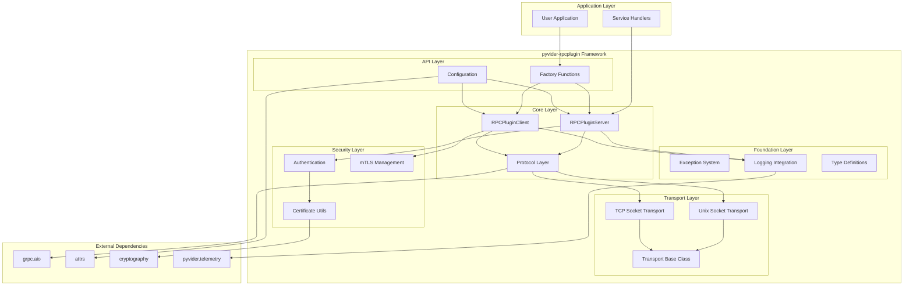
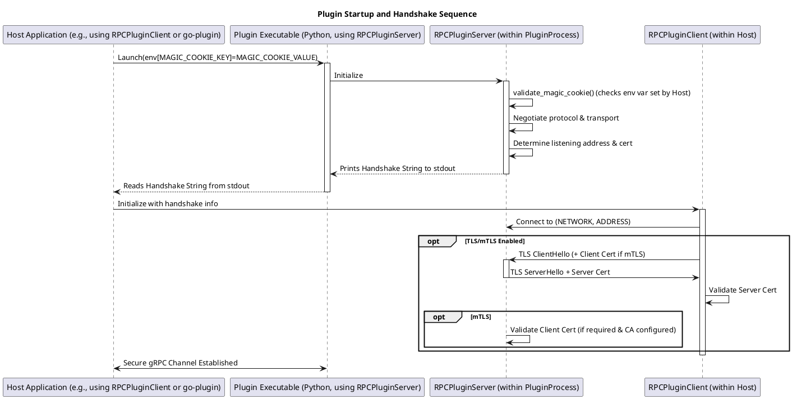
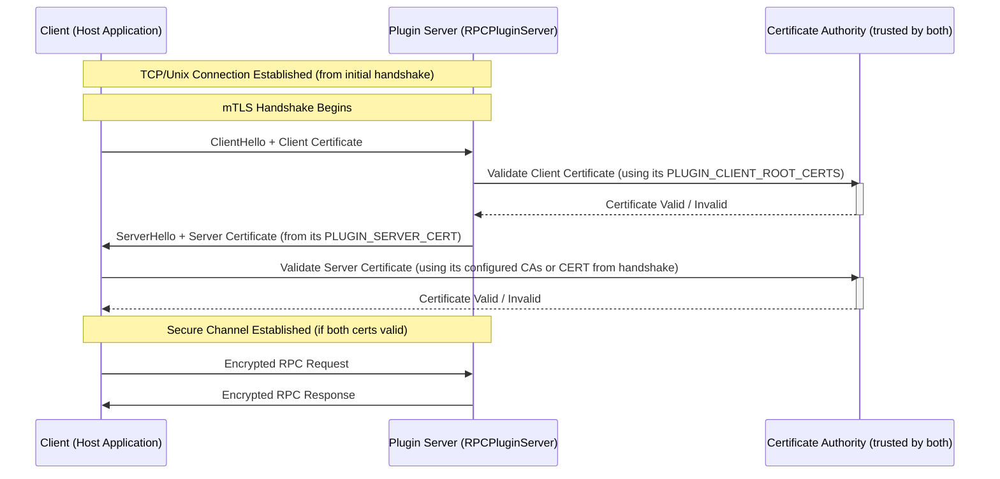

# Architecture Guide - pyvider-rpcplugin

This document provides a comprehensive overview of the `pyvider-rpcplugin` architecture, design patterns, and implementation details.

## Table of Contents

- [System Overview](#system-overview)
- [Core Architecture](#core-architecture)
- [Component Design](#component-design)
- [Transport Layer](#transport-layer)
- [Protocol Layer](#protocol-layer)
- [Security Architecture](#security-architecture)
- [Configuration System](#configuration-system)
- [Error Handling Strategy](#error-handling-strategy)
- [Performance Design](#performance-design)
- [Extension Points](#extension-points)

## System Overview

`pyvider-rpcplugin` is designed as a high-performance, secure RPC plugin framework built on gRPC with a focus on ease of use, type safety, and production readiness.

### Design Principles

1. **Performance First** - Optimized for high-throughput, low-latency communication
2. **Security by Default** - Built-in mTLS and authentication mechanisms
3. **Developer Experience** - Simple APIs with comprehensive type annotations
4. **Production Ready** - Robust error handling, monitoring, and operational features
5. **Extensible** - Clean interfaces for custom transports and protocols

### Key Features

- **Async-native** - Built on Python's `asyncio` for maximum concurrency
- **Multi-transport** - Support for Unix sockets and TCP with automatic negotiation
- **Type-safe** - Complete type annotations with modern Python 3.13+ features
- **Observable** - Integrated structured logging and metrics collection
- **Configurable** - Flexible configuration via environment, files, or code

## Core Architecture



## Component Design

### Factory Pattern

The framework uses factory functions as the primary API for creating components:

```python
# High-level factory functions
server = plugin_server(protocol, handler, transport="tcp")
client = plugin_client(command=["./path_to_executable"]) # Corrected: uses 'command'
protocol = plugin_protocol(service_name, descriptor_module, servicer_add_fn)

# Lower-level direct instantiation
# server = RPCPluginServer(protocol, handler, config, transport) # Direct use is less common
```

**Benefits:**
- Simplified API for common use cases
- Sensible defaults with customization options
- Consistent configuration patterns
- Easy testing and mocking

### Dependency Injection

Configuration and dependencies flow through the system via dependency injection:

```python
from pyvider.rpcplugin import configure, plugin_server # Assuming imports

# Configuration flows down through the stack
configure(PLUGIN_AUTO_MTLS=True, PLUGIN_SERVER_TRANSPORTS=["tcp"])
# server = plugin_server(protocol, handler)  # Inherits global config (conceptual)
# Actual server creation requires protocol and handler instances.
```

### Async Context Management

The `RPCPluginClient` class supports async context management for resource cleanup:

```python
from pyvider.rpcplugin import plugin_client # Assuming import
# client_instance = plugin_client(command=["./my_plugin"])
# async with client_instance:
#     # client_instance.start() is called by __aenter__
#     # client_instance is now ready to use, e.g., client_instance.grpc_channel
#     # logger.info(f"Client active, target: {client_instance.target_endpoint}")
#     # ... use client_instance ...
# # client_instance.close() (which includes shutdown_plugin if applicable) is called by __aexit__
print("Note: For a runnable example of RPCPluginClient with async context management, see its class docstring or tests.")
```
The `RPCPluginServer` is typically run via its `serve()` method and managed by signals or direct `stop()` calls rather than an async context manager pattern for its main lifecycle.

## Transport Layer

### Transport Abstraction

The transport layer provides a clean abstraction over different communication mechanisms:

```python
class RPCPluginTransport(ABC):
    @abstractmethod
    async def listen(self) -> str:
        """Start listening and return endpoint."""
        
    @abstractmethod  
    async def connect(self, endpoint: str) -> None:
        """Connect to remote endpoint."""
        
    @abstractmethod
    async def close(self) -> None:
        """Close transport and cleanup resources."""
```

### Unix Socket Transport

Optimized for high-performance local inter-process communication:

```python
class UnixSocketTransport(RPCPluginTransport):
    def __init__(self, path: Optional[str] = None):
        self.path = path or self._generate_socket_path()
        self._server_socket = None
        self._running = False
    
    async def listen(self) -> str:
        # Create Unix domain socket
        # Set appropriate permissions
        # Return socket path
        
    async def connect(self, endpoint: str) -> None:
        # Validate socket file exists
        # Create client connection
        # Handle connection errors
```

**Features:**
- Automatic socket path generation
- Proper file permissions and cleanup
- High performance (50K+ req/s)
- Security through filesystem permissions

### TCP Socket Transport

Network communication with support for remote clients:

```python
class TCPSocketTransport(RPCPluginTransport):
    def __init__(self, host: str = "127.0.0.1", port: int = 0):
        self.host = host
        self.port = port
        self._server = None
        
    async def listen(self) -> str:
        # Bind to host:port
        # Handle port auto-assignment
        # Return actual endpoint
        
    async def connect(self, endpoint: str) -> None:
        # Parse host:port from endpoint
        # Create TCP connection
        # Handle network timeouts
```

**Features:**
- Automatic port assignment
- IPv4/IPv6 support
- Connection timeout handling
- Network error recovery

### Transport Negotiation

Automatic transport selection based on configuration and availability:

```python
def negotiate_transport(
    transports: List[str],
    endpoint: Optional[str] = None
) -> RPCPluginTransport:
    """Select best transport based on availability and performance."""
    
    if endpoint:
        # Use endpoint to determine transport type
        if endpoint.startswith('/') or endpoint.startswith('unix:'):
            return UnixSocketTransport(path=endpoint)
        else:
            host, port = parse_tcp_endpoint(endpoint)
            return TCPSocketTransport(host=host, port=port)
    
    # Auto-select based on preferences
    for transport_type in transports:
        if transport_type == "unix" and unix_sockets_available():
            return UnixSocketTransport()
        elif transport_type == "tcp":
            return TCPSocketTransport()
    
    raise TransportError("No suitable transport available")
```

## Protocol Layer

### gRPC Integration

The protocol layer integrates with gRPC while providing a clean abstraction:

```python
class RPCPluginProtocol(ABC):
    @abstractmethod
    async def get_grpc_descriptors(self) -> Tuple[Any, str]:
        """Return gRPC descriptors and service name."""
        
    @abstractmethod
    async def add_to_server(self, handler: Any, server: grpc.aio.Server) -> None:
        """Register service handler with gRPC server."""
```

### Service Registration

Services are registered through a standardized pattern:

```python
async def add_to_server(self, handler: HandlerT, server: grpc.aio.Server) -> None:
    """Register handler with gRPC server."""
    
    # Validate handler implements required methods
    self._validate_handler(handler)
    
    # Register with gRPC server using generated function
    self.servicer_add_fn(handler, server)
    
    # Register additional protocol services (broker, stdio, controller)
    register_protocol_service(server, self._shutdown_event)
```

### Protocol Services

Built-in protocol services provide framework functionality:

- **Broker Service** - Connection management and service discovery
- **Stdio Service** - Input/output redirection for debugging
- **Controller Service** - Service lifecycle and health management

## Security Architecture

### Plugin Startup and Handshake Sequence

The initial startup and handshake process between the host (e.g., a Go application using `go-plugin`) and the Python plugin (`RPCPluginServer`) is critical for establishing communication. Here's a step-by-step breakdown:

1.  **Host Configuration (Magic Cookie):**
    *   The host application is configured with a `PLUGIN_MAGIC_COOKIE_KEY` (e.g., "FOO_PLUGIN_MAGIC_COOKIE") and a corresponding `PLUGIN_MAGIC_COOKIE_VALUE` (e.g., "BAR"). These are secrets shared between the host and the plugin.

2.  **Host Launches Plugin:**
    *   The host launches the plugin executable.
    *   Crucially, it sets an environment variable for the plugin process. The *name* of this environment variable is the value of `PLUGIN_MAGIC_COOKIE_KEY` (e.g., `FOO_PLUGIN_MAGIC_COOKIE`), and its *value* is the `PLUGIN_MAGIC_COOKIE_VALUE` (e.g., "BAR").

3.  **Plugin (`RPCPluginServer`) Startup:**
    *   **Magic Cookie Validation:** The `RPCPluginServer` instance, upon initialization, calls `validate_magic_cookie()`. This function reads its *own* environment variable (whose name is specified by its *own* configuration, also `PLUGIN_MAGIC_COOKIE_KEY`) and compares its value to its *own* configured `PLUGIN_MAGIC_COOKIE_VALUE`. This step verifies that the plugin was launched by a legitimate host that knows the shared secret.
    *   **Protocol & Transport Negotiation:** The server determines the protocol version and transport type (Unix socket or TCP) it will use, based on its configuration and capabilities.
    *   **Address & Certificate Preparation:** It sets up its listening address. If TLS is configured, it prepares its server certificate.
    *   **Handshake String Output:** The server prints a specific handshake string to its standard output (stdout). The format is:
        `CORE_VERSION|PLUGIN_VERSION|NETWORK|ADDRESS|PROTOCOL|CERT`
        *   `CORE_VERSION`: Core protocol version (e.g., "1").
        *   `PLUGIN_VERSION`: Plugin-specific protocol version.
        *   `NETWORK`: "unix" or "tcp".
        *   `ADDRESS`: The socket path (for unix) or "127.0.0.1:PORT" (for tcp). The `127.0.0.1` is standard for same-host plugin communication.
        *   `PROTOCOL`: Typically "grpc".
        *   `CERT`: Server's public certificate (PEM format, base64 encoded, newlines removed), if TLS is enabled. Otherwise, this part is empty.

4.  **Host (`RPCPluginClient`) Reads Handshake String:**
    *   The host application captures and parses this handshake string from the plugin's stdout.

5.  **Host Connects to Plugin:**
    *   Using the `NETWORK` and `ADDRESS` from the parsed handshake string, the host (via `RPCPluginClient`) initiates a connection to the plugin server.

6.  **TLS/mTLS Handshake (if applicable):**
    *   If the handshake string indicated TLS (by providing a `CERT`), a standard TLS handshake occurs over the established connection.
    *   **Server Authentication:** The client validates the server's certificate. This might involve using the `CERT` from the handshake string directly (if the host trusts it by virtue of launching the plugin) or validating it against a set of configured Certificate Authorities (CAs).
    *   **Client Authentication (mTLS):** If mutual TLS (mTLS) is configured on the server (`PLUGIN_AUTO_MTLS=true`), the server will request and validate the client's certificate against its own configured `PLUGIN_CLIENT_ROOT_CERTS`.

7.  **Secure gRPC Channel Established:**
    *   Once all handshakes (plugin handshake and TLS/mTLS handshake) are complete, a secure gRPC channel is established, and RPC communication can begin.

**Sequence Diagram:**



### mTLS Implementation

Mutual TLS is implemented at the transport layer with certificate management:

```python
class SecurityManager:
    def __init__(self, config: SecurityConfig):
        self.config = config
        self.ca_cert = None
        self.server_cert = None
        self.client_cert = None
    
    async def setup_server_credentials(self) -> grpc.ServerCredentials:
        """Create server credentials with client certificate validation."""
        
        # Load server certificate and key
        server_cert = await self._load_certificate(self.config.server_cert)
        server_key = await self._load_private_key(self.config.server_key)
        
        # Load CA for client validation
        ca_cert = await self._load_certificate(self.config.ca_cert)
        
        # Create mTLS credentials
        return grpc.ssl_server_credentials(
            private_key_certificate_chain_pairs=[(server_key, server_cert)],
            root_certificates=ca_cert,
            require_client_auth=True
        )
    
    async def setup_client_credentials(self) -> grpc.ChannelCredentials:
        """Create client credentials for server authentication."""
        
        # Load client certificate and key  
        client_cert = await self._load_certificate(self.config.client_cert)
        client_key = await self._load_private_key(self.config.client_key)
        
        # Load CA for server validation
        ca_cert = await self._load_certificate(self.config.ca_cert)
        
        # Create mTLS credentials
        return grpc.ssl_channel_credentials(
            root_certificates=ca_cert,
            private_key=client_key,
            certificate_chain=client_cert
        )
```

### mTLS Handshake Details

This diagram focuses on the specifics of the Mutual TLS (mTLS) handshake that occurs *after* the initial plugin handshake (where the handshake string is exchanged) and the host has connected to the network address provided by the plugin.



### Certificate Management

Automated certificate generation and validation:

```python
class Certificate:
    @classmethod
    def create_ca(
        cls,
        common_name: str,
        organization_name: str, # Corrected: was 'Optional[str] = None'
        validity_days: int,
        key_type: str = "ecdsa", # Added, matches code
        key_size: int = 2048,    # Added, matches code
        ecdsa_curve: str = "secp384r1" # Added, matches code
    ) -> "Certificate": # Use "Certificate" for self-reference
        """Generate self-signed CA certificate."""
        # Implementation in crypto/certificate.py
        
    @classmethod
    def create_signed_certificate(
        cls,
        ca_certificate: "Certificate", # Corrected: type is Certificate
        common_name: str,
        organization_name: str, # Corrected: was 'Optional[str] = None'
        validity_days: int,
        alt_names: list[str] | None = None, # Corrected: List[str] | None
        key_type: str = "ecdsa",        # Added, matches code
        key_size: int = 2048,           # Added, matches code
        ecdsa_curve: str = "secp384r1", # Added, matches code
        is_client_cert: bool = False
    ) -> "Certificate":
        """Generate server or client certificate signed by CA."""
        # Implementation in crypto/certificate.py
```
The `.cert` (PEM string of the certificate) and `.key` (PEM string of the private key, if available) attributes are used to access the certificate data.

## Configuration System

### Hierarchical Configuration

Configuration follows a hierarchical precedence model:

1. **Programmatic** - Direct API calls (highest priority)
2. **Environment Variables** - Runtime configuration
3. **Configuration Files** - Persistent settings
4. **Defaults** - Built-in sensible defaults (lowest priority)

```python
class RPCPluginConfig:
    def __init__(self):
        self.config = {}
        self._load_defaults()
        self._load_from_files()
        self._load_from_environment()
    
    def set(self, key: str, value: Any) -> None:
        """Set configuration value (highest priority)."""
        self.config[key] = self._validate_and_convert(key, value)
    
    def get(self, key: str, default: Any = None) -> Any:
        """Get configuration value with fallback."""
        return self.config.get(key, default)
```

### Configuration Schema

Type-safe configuration with validation:

```python
CONFIG_SCHEMA = {
    "PLUGIN_MAGIC_COOKIE_VALUE": {
        "type": "str",
        "required": True,
        "default": "rpcplugin-default-cookie",
        "description": "Authentication cookie for handshake validation"
    },
    "PLUGIN_PROTOCOL_VERSIONS": {
        "type": "list_int", 
        "required": True,
        "default": [1],
        "description": "Supported protocol versions"
    },
    "PLUGIN_AUTO_MTLS": {
        "type": "bool",
        "required": True,
        "default": True,
        "description": "Enable automatic mTLS configuration"
    }
}
```

## Error Handling Strategy

### Exception Hierarchy

Structured exception hierarchy for precise error handling:

```python
class RPCPluginError(Exception):
    """Base exception for all RPC plugin errors."""

class TransportError(RPCPluginError):
    """Transport layer errors (connection, binding, etc.)."""

class ProtocolError(RPCPluginError):
    """Protocol layer errors (service registration, gRPC)."""

class HandshakeError(RPCPluginError):
    """Authentication and handshake errors."""

class SecurityError(RPCPluginError):
    """Security-related errors (certificates, validation)."""
```

### Error Context

Rich error context for debugging and recovery:

```python
class ContextualError(RPCPluginError):
    def __init__(
        self,
        message: str,
        context: Dict[str, Any] = None,
        cause: Exception = None
    ):
        super().__init__(message)
        self.context = context or {}
        self.cause = cause
    
    def add_context(self, key: str, value: Any) -> 'ContextualError':
        """Add contextual information to error."""
        self.context[key] = value
        return self
```

### Recovery Patterns

Built-in retry and recovery mechanisms:

```python
async def with_retry(
    operation: Callable,
    max_retries: int = 3,
    backoff_factor: float = 1.0,
    exceptions: Tuple[Exception, ...] = (TransportError,)
) -> Any:
    """Execute operation with exponential backoff retry."""
    
    for attempt in range(max_retries + 1):
        try:
            return await operation()
        except exceptions as e:
            if attempt == max_retries:
                raise
            
            delay = backoff_factor * (2 ** attempt)
            await asyncio.sleep(delay)
```

## Performance Design

### Async Architecture

Full async/await integration for maximum concurrency:

```python
class RPCPluginServer:
    async def serve(self) -> None:
        """Serve requests concurrently."""
        
        # Setup transport concurrently
        await self._setup_transport()
        
        # Start gRPC server
        await self._grpc_server.start()
        
        # Handle shutdown signals
        async with self._shutdown_context():
            await self._grpc_server.wait_for_termination()
```

### Connection Pooling

Efficient connection management:

```python
class ConnectionPool:
    def __init__(self, max_size: int = 10):
        self.max_size = max_size
        self.pool = asyncio.Queue(maxsize=max_size)
        self.created = 0
    
    async def acquire(self) -> RPCPluginClient:
        """Get client from pool or create new one."""
        
        try:
            return self.pool.get_nowait()
        except asyncio.QueueEmpty:
            if self.created < self.max_size:
                self.created += 1
                return await self._create_client()
            else:
                return await self.pool.get()
    
    async def release(self, client: RPCPluginClient) -> None:
        """Return client to pool."""
        await self.pool.put(client)
```

### Memory Management

Efficient resource usage patterns:

- **Lazy initialization** - Components created only when needed
- **Resource cleanup** - Automatic cleanup via async context managers
- **Connection reuse** - Pool connections for repeated operations
- **Streaming support** - Handle large payloads efficiently

## Extension Points

### Custom Transports

Implement custom transport mechanisms:

```python
class CustomTransport(RPCPluginTransport):
    async def listen(self) -> str:
        # Implement custom server listening logic
        pass
    
    async def connect(self, endpoint: str) -> None:
        # Implement custom client connection logic
        pass
    
    async def close(self) -> None:
        # Implement cleanup logic
        pass

# Register custom transport
# To use a custom transport, instantiate RPCPluginServer directly:
# custom_transport_instance = CustomTransport()
# server = RPCPluginServer(protocol=protocol, handler=handler, transport=custom_transport_instance)
# rather than using the plugin_server() factory.
```

### Custom Protocols

Extend protocol functionality:

```python
class CustomProtocol(RPCPluginProtocol):
    async def get_grpc_descriptors(self) -> Tuple[Any, str]:
        # Return custom gRPC descriptors
        return self.descriptor_module, self.service_name
    
    async def add_to_server(self, handler: Any, server: grpc.aio.Server) -> None:
        # Custom service registration logic
        self.servicer_add_fn(handler, server)
        
        # Add custom interceptors
        await self._add_custom_interceptors(server)
```

### Middleware Support

Add cross-cutting concerns:

```python
class LoggingInterceptor(grpc.aio.ServerInterceptor):
    async def intercept_service(self, continuation, handler_call_details):
        start_time = time.time()
        
        try:
            response = await continuation(handler_call_details)
            logger.info("RPC completed", duration=time.time() - start_time)
            return response
        except Exception as e:
            logger.error("RPC failed", error=str(e))
            raise

# Add to server
server.add_interceptor(LoggingInterceptor())
```

## Design Patterns

### Builder Pattern

Complex configuration building:

```python
class ServerBuilder:
    def __init__(self):
        self._protocol = None
        self._handler = None
        self._config = {}
    
    def with_protocol(self, protocol: ProtocolT) -> 'ServerBuilder':
        self._protocol = protocol
        return self
    
    def with_handler(self, handler: HandlerT) -> 'ServerBuilder':
        self._handler = handler
        return self
    
    def with_config(self, **config) -> 'ServerBuilder':
        self._config.update(config)
        return self
    
    def build(self) -> RPCPluginServer:
        return RPCPluginServer(
            protocol=self._protocol,
            handler=self._handler,
            config=self._config
        )
```

### Observer Pattern

Event-driven architecture:

```python
class EventManager:
    def __init__(self):
        self._listeners = defaultdict(list)
    
    def subscribe(self, event_type: str, callback: Callable) -> None:
        self._listeners[event_type].append(callback)
    
    async def publish(self, event_type: str, data: Any) -> None:
        for callback in self._listeners[event_type]:
            await callback(data)

# Usage
events.subscribe("connection.established", log_connection)
events.subscribe("request.completed", update_metrics)
```

### Strategy Pattern

Pluggable algorithms:

```python
class CompressionStrategy(ABC):
    @abstractmethod
    def compress(self, data: bytes) -> bytes:
        pass
    
    @abstractmethod
    def decompress(self, data: bytes) -> bytes:
        pass

class GzipCompression(CompressionStrategy):
    def compress(self, data: bytes) -> bytes:
        return gzip.compress(data)
    
    def decompress(self, data: bytes) -> bytes:
        return gzip.decompress(data)

# Configurable compression
server = plugin_server(
    protocol=protocol,
    handler=handler,
    compression_strategy=GzipCompression()
)
```

This architecture provides a solid foundation for building high-performance, secure, and maintainable RPC-based applications while remaining flexible enough to accommodate diverse use cases and requirements.
