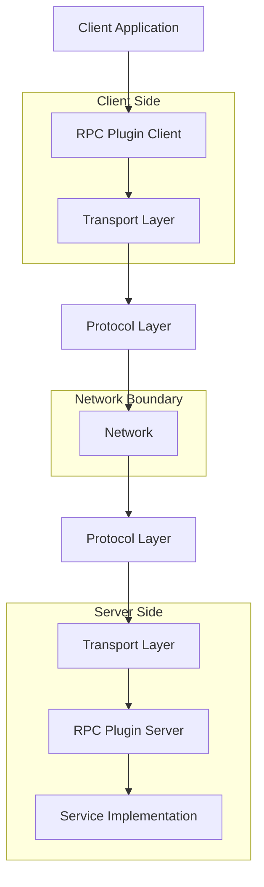
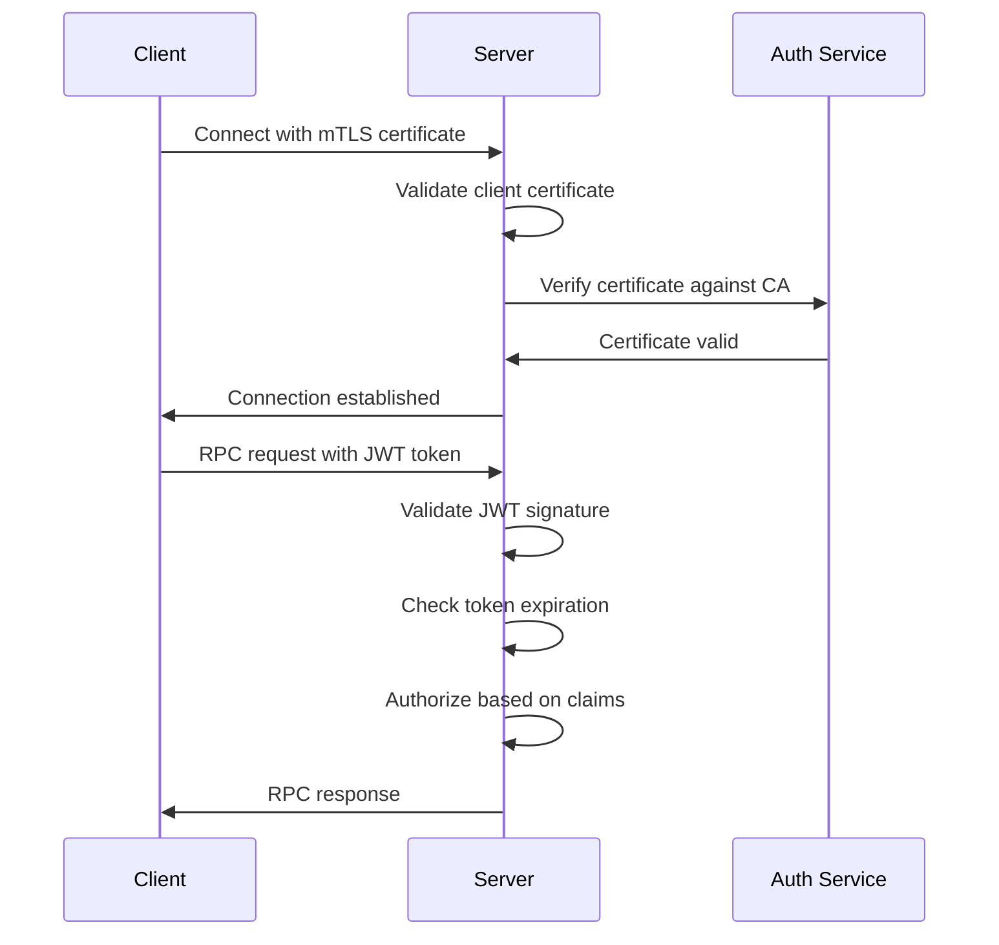

# Architecture

This document provides a comprehensive overview of the Pyvider RPC Plugin architecture, including design principles, component relationships, and implementation details.

## System Overview

The Pyvider RPC Plugin framework is built with a **layered architecture** that separates concerns and provides flexibility for different use cases:



### Core Design Principles

1. **Separation of Concerns** - Each layer has a single, well-defined responsibility
2. **Transport Agnostic** - Support multiple transport mechanisms (Unix sockets, TCP, etc.)
3. **Protocol Flexibility** - Pluggable protocol implementations
4. **Type Safety** - Comprehensive type annotations throughout
5. **Async First** - Built on asyncio for high performance
6. **Security by Default** - mTLS and authentication built-in
7. **Production Ready** - Comprehensive error handling, logging, and monitoring

## Component Architecture

### 1. Transport Layer

The transport layer handles low-level communication between client and server:

```python
# src/pyvider/transport/base.py
from abc import ABC, abstractmethod
from typing import Any, AsyncGenerator
import asyncio

class BaseTransport(ABC):
    """Abstract base class for all transport implementations."""
    
    def __init__(self, config: TransportConfig):
        self.config = config
        self._connection: Any | None = None
        self._lock = asyncio.Lock()
    
    @abstractmethod
    async def connect(self, address: str) -> None:
        """Establish connection to the specified address."""
        pass
    
    @abstractmethod
    async def disconnect(self) -> None:
        """Close the connection."""
        pass
    
    @abstractmethod
    async def send(self, data: bytes) -> None:
        """Send data over the transport."""
        pass
    
    @abstractmethod
    async def receive(self) -> bytes:
        """Receive data from the transport."""
        pass
    
    @abstractmethod
    async def is_connected(self) -> bool:
        """Check if transport is connected."""
        pass
```

#### Transport Implementations

**Unix Domain Socket Transport**
```python
# src/pyvider/transport/unix.py
import os
import asyncio
from pathlib import Path

class UnixSocketTransport(BaseTransport):
    """Unix domain socket transport for local communication."""
    
    async def connect(self, socket_path: str) -> None:
        """Connect to Unix domain socket."""
        if not Path(socket_path).exists():
            raise TransportError(f"Socket path does not exist: {socket_path}")
        
        try:
            reader, writer = await asyncio.open_unix_connection(socket_path)
            self._connection = (reader, writer)
        except OSError as e:
            raise TransportError(f"Failed to connect to {socket_path}: {e}")
    
    async def send(self, data: bytes) -> None:
        """Send data over Unix socket."""
        if not self._connection:
            raise TransportError("Not connected")
        
        _, writer = self._connection
        
        # Send length prefix + data
        length = len(data)
        writer.write(length.to_bytes(4, 'big'))
        writer.write(data)
        await writer.drain()
    
    async def receive(self) -> bytes:
        """Receive data from Unix socket."""
        if not self._connection:
            raise TransportError("Not connected")
        
        reader, _ = self._connection
        
        # Read length prefix
        length_bytes = await reader.readexactly(4)
        length = int.from_bytes(length_bytes, 'big')
        
        # Read data
        data = await reader.readexactly(length)
        return data
```

**TCP Socket Transport**
```python
# src/pyvider/transport/tcp.py
import ssl
import asyncio
from typing import Any

class TCPTransport(BaseTransport):
    """TCP transport with optional TLS support."""
    
    def __init__(self, config: TransportConfig):
        super().__init__(config)
        self._ssl_context: ssl.SSLContext | None = None
        
        if config.tls_enabled:
            self._ssl_context = self._create_ssl_context()
    
    def _create_ssl_context(self) -> ssl.SSLContext:
        """Create SSL context for secure connections."""
        context = ssl.create_default_context(ssl.Purpose.SERVER_AUTH)
        
        if self.config.ca_cert_file:
            context.load_verify_locations(self.config.ca_cert_file)
        
        if self.config.cert_file and self.config.key_file:
            context.load_cert_chain(self.config.cert_file, self.config.key_file)
        
        return context
    
    async def connect(self, address: str) -> None:
        """Connect to TCP server."""
        host, port = address.split(':', 1)
        port = int(port)
        
        try:
            reader, writer = await asyncio.open_connection(
                host, port, ssl=self._ssl_context
            )
            self._connection = (reader, writer)
        except OSError as e:
            raise TransportError(f"Failed to connect to {host}:{port}: {e}")
```

### 2. Protocol Layer

The protocol layer handles message serialization, service discovery, and RPC semantics:

```python
# src/pyvider/protocol/base.py
from abc import ABC, abstractmethod
from typing import Any, TypeVar, Generic
import asyncio

T = TypeVar('T')
U = TypeVar('U')

class BaseProtocol(ABC, Generic[T, U]):
    """Abstract base class for RPC protocols."""
    
    def __init__(self, transport: BaseTransport):
        self.transport = transport
        self._message_id = 0
        self._pending_requests: dict[int, asyncio.Future] = {}
    
    @abstractmethod
    async def serialize_request(self, method: str, args: T) -> bytes:
        """Serialize request for transmission."""
        pass
    
    @abstractmethod
    async def deserialize_request(self, data: bytes) -> tuple[str, T]:
        """Deserialize incoming request."""
        pass
    
    @abstractmethod
    async def serialize_response(self, response: U) -> bytes:
        """Serialize response for transmission."""
        pass
    
    @abstractmethod
    async def deserialize_response(self, data: bytes) -> U:
        """Deserialize incoming response."""
        pass
    
    def _generate_message_id(self) -> int:
        """Generate unique message ID for request tracking."""
        self._message_id += 1
        return self._message_id
```

#### gRPC Protocol Implementation

```python
# src/pyvider/protocol/grpc.py
import grpc
from google.protobuf.message import Message
from grpc.aio import insecure_channel, secure_channel

class GRPCProtocol(BaseProtocol):
    """gRPC protocol implementation."""
    
    def __init__(self, transport: BaseTransport, service_pb2: Any):
        super().__init__(transport)
        self.service_pb2 = service_pb2
        self._channel: grpc.aio.Channel | None = None
        self._stub: Any | None = None
    
    async def initialize_client(self, target: str, credentials: grpc.ChannelCredentials | None = None):
        """Initialize gRPC client."""
        if credentials:
            self._channel = secure_channel(target, credentials)
        else:
            self._channel = insecure_channel(target)
        
        self._stub = self.service_pb2.ServiceStub(self._channel)
    
    async def call_method(self, method_name: str, request: Message) -> Message:
        """Call remote method via gRPC."""
        if not self._stub:
            raise ProtocolError("Client not initialized")
        
        method = getattr(self._stub, method_name)
        
        try:
            response = await method(request)
            return response
        except grpc.RpcError as e:
            raise ProtocolError(f"RPC call failed: {e.code()}: {e.details()}")
    
    async def close(self):
        """Close gRPC channel."""
        if self._channel:
            await self._channel.close()
```

### 3. Server Architecture

The server architecture provides a high-level interface for implementing RPC services:

```python
# src/pyvider/server/server.py
import asyncio
import logging
from typing import Any, Callable
from grpc.aio import Server, add_insecure_port, add_secure_port

logger = logging.getLogger(__name__)

class RPCPluginServer:
    """High-level RPC server implementation."""
    
    def __init__(self, config: ServerConfig):
        self.config = config
        self._server: Server | None = None
        self._services: list[Any] = []
        self._interceptors: list[Any] = []
        self._health_servicer = None
        self._shutdown_event = asyncio.Event()
    
    def add_service(self, service: Any) -> None:
        """Add RPC service to the server."""
        self._services.append(service)
        logger.info(f"Added service: {service.__class__.__name__}")
    
    def add_interceptor(self, interceptor: Any) -> None:
        """Add gRPC interceptor to the server."""
        self._interceptors.append(interceptor)
        logger.info(f"Added interceptor: {interceptor.__class__.__name__}")
    
    async def start(self) -> None:
        """Start the RPC server."""
        logger.info("Starting RPC server...")
        
        # Create gRPC server with interceptors
        self._server = Server(interceptors=self._interceptors)
        
        # Add services
        for service in self._services:
            service_name = service.__class__.__name__
            add_servicer = getattr(service, 'add_to_server', None)
            
            if add_servicer:
                add_servicer(service, self._server)
                logger.info(f"Registered service: {service_name}")
            else:
                logger.error(f"Service {service_name} has no add_to_server method")
        
        # Configure server port
        if self.config.tls_enabled:
            credentials = self._create_server_credentials()
            port = add_secure_port(
                self._server, 
                f"{self.config.host}:{self.config.port}",
                credentials
            )
        else:
            port = add_insecure_port(
                self._server,
                f"{self.config.host}:{self.config.port}"
            )
        
        # Start server
        await self._server.start()
        logger.info(f"Server started on {self.config.host}:{port}")
        
        # Setup graceful shutdown
        self._setup_signal_handlers()
    
    async def stop(self, grace_period: int = 30) -> None:
        """Stop the RPC server gracefully."""
        if not self._server:
            return
        
        logger.info("Stopping RPC server...")
        
        # Signal shutdown
        self._shutdown_event.set()
        
        # Stop accepting new requests
        await self._server.stop(grace_period)
        
        logger.info("RPC server stopped")
    
    def _create_server_credentials(self):
        """Create server TLS credentials."""
        import grpc
        
        with open(self.config.key_file, 'rb') as f:
            private_key = f.read()
        
        with open(self.config.cert_file, 'rb') as f:
            certificate_chain = f.read()
        
        return grpc.ssl_server_credentials([(private_key, certificate_chain)])
```

### 4. Client Architecture

The client provides a simplified interface for making RPC calls:

```python
# src/pyvider/client/client.py
import asyncio
import logging
from typing import Any, Generic, TypeVar
from grpc.aio import insecure_channel, secure_channel

T = TypeVar('T')
U = TypeVar('U')

logger = logging.getLogger(__name__)

class RPCPluginClient(Generic[T, U]):
    """High-level RPC client implementation."""
    
    def __init__(self, config: ClientConfig):
        self.config = config
        self._channel = None
        self._stub = None
        self._connection_pool = ConnectionPool(config.pool_size)
        self._retry_policy = RetryPolicy(config.retry_config)
    
    async def connect(self) -> None:
        """Establish connection to RPC server."""
        target = f"{self.config.host}:{self.config.port}"
        
        if self.config.tls_enabled:
            credentials = self._create_client_credentials()
            self._channel = secure_channel(target, credentials)
        else:
            self._channel = insecure_channel(target)
        
        # Create service stub
        self._stub = self.config.service_stub_class(self._channel)
        
        # Test connection
        await self._test_connection()
        
        logger.info(f"Connected to {target}")
    
    async def call(
        self, 
        method_name: str, 
        request: T, 
        timeout: float | None = None
    ) -> U:
        """Make RPC call with retry logic."""
        if not self._stub:
            raise ClientError("Client not connected")
        
        async def _make_call() -> U:
            method = getattr(self._stub, method_name)
            return await method(request, timeout=timeout)
        
        # Apply retry policy
        return await self._retry_policy.execute(_make_call)
    
    async def stream_call(
        self, 
        method_name: str, 
        request_iterator: AsyncIterator[T]
    ) -> AsyncIterator[U]:
        """Make streaming RPC call."""
        if not self._stub:
            raise ClientError("Client not connected")
        
        method = getattr(self._stub, method_name)
        
        async for response in method(request_iterator):
            yield response
    
    async def close(self) -> None:
        """Close client connection."""
        if self._channel:
            await self._channel.close()
            logger.info("Client connection closed")
```

### 5. Configuration System

Centralized configuration management with validation:

```python
# src/pyvider/config/schema.py
from dataclasses import dataclass, field
from typing import Any
from pathlib import Path

@dataclass
class TransportConfig:
    """Transport layer configuration."""
    type: str = "tcp"  # tcp, unix
    host: str = "localhost"
    port: int = 50051
    socket_path: str | None = None
    tls_enabled: bool = False
    cert_file: str | None = None
    key_file: str | None = None
    ca_cert_file: str | None = None
    
    def __post_init__(self):
        """Validate configuration after initialization."""
        if self.type == "unix" and not self.socket_path:
            raise ValueError("socket_path required for Unix transport")
        
        if self.tls_enabled:
            if not self.cert_file or not self.key_file:
                raise ValueError("cert_file and key_file required for TLS")

@dataclass
class ServerConfig:
    """Server configuration."""
    transport: TransportConfig = field(default_factory=TransportConfig)
    max_workers: int = 10
    max_connections: int = 1000
    request_timeout: float = 30.0
    keepalive_timeout: int = 300
    log_level: str = "INFO"
    enable_health_check: bool = True
    enable_reflection: bool = False
    
    @classmethod
    def from_file(cls, path: Path) -> 'ServerConfig':
        """Load configuration from file."""
        import json
        
        with open(path) as f:
            data = json.load(f)
        
        return cls(**data)
    
    @classmethod 
    def from_env(cls) -> 'ServerConfig':
        """Load configuration from environment variables."""
        import os
        
        return cls(
            transport=TransportConfig(
                host=os.getenv('RPC_HOST', 'localhost'),
                port=int(os.getenv('RPC_PORT', '50051')),
                tls_enabled=os.getenv('RPC_TLS_ENABLED', 'false').lower() == 'true',
                cert_file=os.getenv('RPC_CERT_FILE'),
                key_file=os.getenv('RPC_KEY_FILE'),
            ),
            max_workers=int(os.getenv('RPC_MAX_WORKERS', '10')),
            log_level=os.getenv('RPC_LOG_LEVEL', 'INFO'),
        )
```

## Service Implementation Patterns

### Basic Service

```python
# example_service.py
import asyncio
from typing import AsyncIterator
from pyvider.service import BaseService
from .generated import service_pb2, service_pb2_grpc

class EchoService(service_pb2_grpc.EchoServiceServicer, BaseService):
    """Example RPC service implementation."""
    
    async def Echo(
        self, 
        request: service_pb2.EchoRequest, 
        context: grpc.aio.ServicerContext
    ) -> service_pb2.EchoResponse:
        """Echo the received message back to client."""
        logger.info(f"Echo request: {request.message}")
        
        return service_pb2.EchoResponse(
            message=request.message,
            timestamp=time.time()
        )
    
    async def StreamEcho(
        self,
        request: service_pb2.EchoRequest,
        context: grpc.aio.ServicerContext
    ) -> AsyncIterator[service_pb2.EchoResponse]:
        """Stream echo responses."""
        for i in range(10):
            yield service_pb2.EchoResponse(
                message=f"{request.message} #{i}",
                timestamp=time.time()
            )
            await asyncio.sleep(1)
```

### Database Service with Connection Pooling

```python
# database_service.py
import asyncpg
from contextlib import asynccontextmanager

class DatabaseService(service_pb2_grpc.DatabaseServiceServicer, BaseService):
    """Database service with connection pooling."""
    
    def __init__(self, db_pool: asyncpg.Pool):
        self.db_pool = db_pool
    
    @asynccontextmanager
    async def get_connection(self):
        """Get database connection from pool."""
        async with self.db_pool.acquire() as conn:
            yield conn
    
    async def GetUser(
        self,
        request: service_pb2.GetUserRequest,
        context: grpc.aio.ServicerContext
    ) -> service_pb2.GetUserResponse:
        """Get user from database."""
        async with self.get_connection() as conn:
            row = await conn.fetchrow(
                "SELECT id, name, email FROM users WHERE id = $1",
                request.user_id
            )
            
            if not row:
                context.abort(grpc.StatusCode.NOT_FOUND, "User not found")
                return
            
            return service_pb2.GetUserResponse(
                user=service_pb2.User(
                    id=row['id'],
                    name=row['name'],
                    email=row['email']
                )
            )
```

## Error Handling Architecture

### Exception Hierarchy

```python
# src/pyvider/exceptions.py
class RPCPluginError(Exception):
    """Base exception for all RPC plugin errors."""
    
    def __init__(self, message: str, details: dict[str, Any] | None = None):
        super().__init__(message)
        self.message = message
        self.details = details or {}

class TransportError(RPCPluginError):
    """Transport layer errors."""
    pass

class ProtocolError(RPCPluginError):
    """Protocol layer errors."""
    pass

class ServiceError(RPCPluginError):
    """Service implementation errors."""
    pass

class ConfigurationError(RPCPluginError):
    """Configuration errors."""
    pass

class AuthenticationError(RPCPluginError):
    """Authentication failures."""
    pass

class AuthorizationError(RPCPluginError):
    """Authorization failures."""
    pass
```

### Error Propagation

```python
# Error handling middleware
class ErrorHandlingInterceptor:
    """Convert Python exceptions to gRPC status codes."""
    
    EXCEPTION_MAPPING = {
        ValidationError: grpc.StatusCode.INVALID_ARGUMENT,
        AuthenticationError: grpc.StatusCode.UNAUTHENTICATED,
        AuthorizationError: grpc.StatusCode.PERMISSION_DENIED,
        NotFoundError: grpc.StatusCode.NOT_FOUND,
        TimeoutError: grpc.StatusCode.DEADLINE_EXCEEDED,
        ServiceUnavailableError: grpc.StatusCode.UNAVAILABLE,
    }
    
    async def intercept_service(self, continuation, handler_call_details):
        try:
            return await continuation(handler_call_details)
        except Exception as e:
            status_code = self.EXCEPTION_MAPPING.get(type(e), grpc.StatusCode.INTERNAL)
            await handler_call_details.context.abort(status_code, str(e))
```

## Performance Architecture

### Connection Pooling

```python
# src/pyvider/client/pool.py
import asyncio
import time
from typing import Any
from collections import deque

class ConnectionPool:
    """Connection pool for efficient resource management."""
    
    def __init__(self, max_size: int = 10, max_idle_time: int = 300):
        self.max_size = max_size
        self.max_idle_time = max_idle_time
        self._pool: deque[tuple[Any, float]] = deque()
        self._in_use: set[Any] = set()
        self._lock = asyncio.Lock()
    
    async def acquire(self) -> Any:
        """Acquire connection from pool."""
        async with self._lock:
            # Try to reuse existing connection
            while self._pool:
                conn, last_used = self._pool.popleft()
                
                if time.time() - last_used > self.max_idle_time:
                    await conn.close()
                    continue
                
                if await conn.is_healthy():
                    self._in_use.add(conn)
                    return conn
                else:
                    await conn.close()
            
            # Create new connection if under limit
            if len(self._in_use) < self.max_size:
                conn = await self._create_connection()
                self._in_use.add(conn)
                return conn
            
            # Wait for connection to be available
            while len(self._in_use) >= self.max_size:
                await asyncio.sleep(0.1)
            
            # Retry acquisition
            return await self.acquire()
    
    async def release(self, conn: Any) -> None:
        """Release connection back to pool."""
        async with self._lock:
            if conn in self._in_use:
                self._in_use.remove(conn)
                
                if await conn.is_healthy():
                    self._pool.append((conn, time.time()))
                else:
                    await conn.close()
```

## Security Architecture

### Authentication Flow



### Security Implementation

```python
# src/pyvider/security/auth.py
import jwt
import time
from typing import Any
from cryptography import x509
from cryptography.hazmat.primitives import hashes

class SecurityManager:
    """Centralized security management."""
    
    def __init__(self, config: SecurityConfig):
        self.config = config
        self._ca_cert = self._load_ca_certificate()
        self._jwt_secret = config.jwt_secret
    
    def validate_certificate(self, cert_der: bytes) -> dict[str, Any]:
        """Validate client certificate against CA."""
        try:
            cert = x509.load_der_x509_certificate(cert_der)
            
            # Check if certificate is signed by our CA
            ca_public_key = self._ca_cert.public_key()
            ca_public_key.verify(
                cert.signature,
                cert.tbs_certificate_bytes,
                cert.signature_algorithm_oid._name
            )
            
            # Extract certificate information
            return {
                'subject': cert.subject.rfc4514_string(),
                'serial_number': str(cert.serial_number),
                'valid_from': cert.not_valid_before,
                'valid_to': cert.not_valid_after,
            }
        
        except Exception as e:
            raise AuthenticationError(f"Certificate validation failed: {e}")
    
    def validate_jwt_token(self, token: str) -> dict[str, Any]:
        """Validate JWT token."""
        try:
            payload = jwt.decode(
                token,
                self._jwt_secret,
                algorithms=['HS256']
            )
            
            # Check expiration
            if payload.get('exp', 0) < time.time():
                raise AuthenticationError("Token expired")
            
            return payload
        
        except jwt.InvalidTokenError as e:
            raise AuthenticationError(f"Invalid token: {e}")
```

This architecture provides a robust, scalable foundation for building RPC services with comprehensive security, performance, and reliability features. The modular design allows for easy extension and customization while maintaining clean separation of concerns.