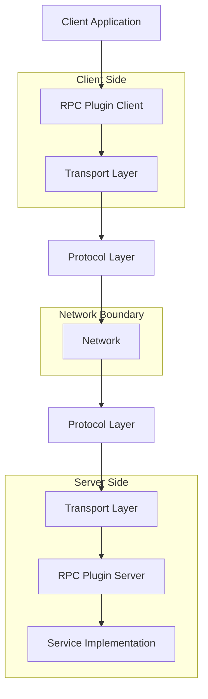
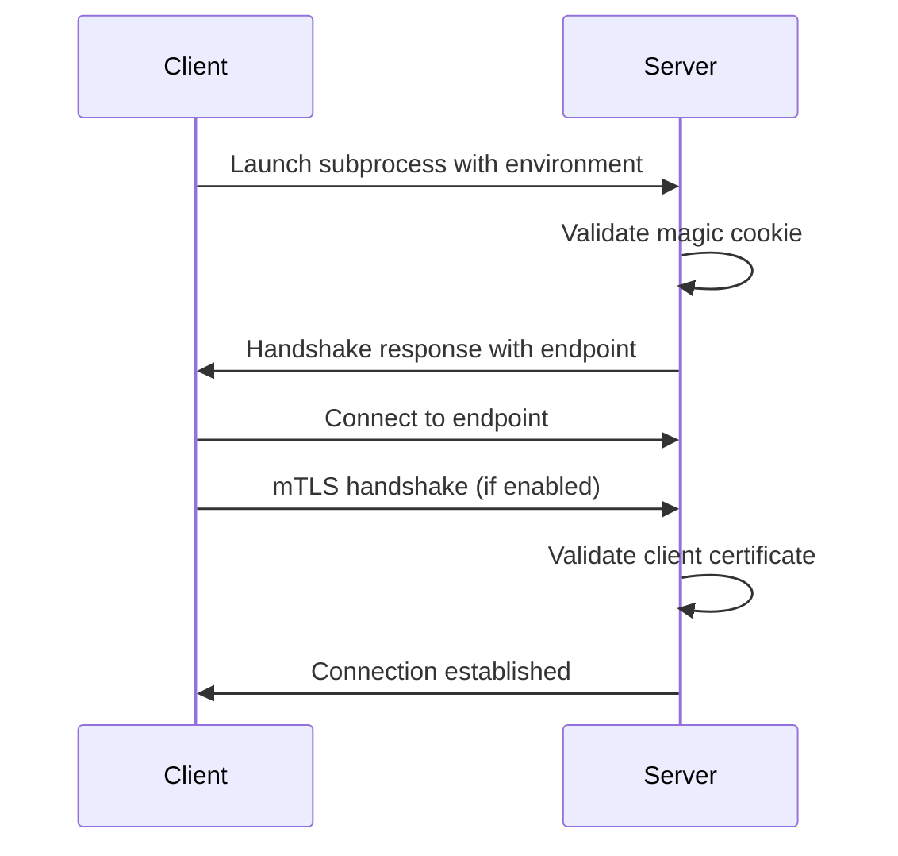

# Architecture

This document provides a comprehensive overview of the Pyvider RPC Plugin architecture, focusing on design principles, component relationships, and integration patterns.

## System Overview

The Pyvider RPC Plugin framework uses a **layered architecture** with clear separation of concerns:



### Core Design Principles

1. **Separation of Concerns** - Each layer has a single, well-defined responsibility
2. **Transport Agnostic** - Support multiple transport mechanisms (Unix sockets, TCP, etc.)
3. **Protocol Flexibility** - Pluggable protocol implementations
4. **Type Safety** - Modern typing throughout (dict, list, set)
5. **Async First** - Built on asyncio for high performance
6. **Security by Default** - mTLS and authentication built-in
7. **Production-focused** - Comprehensive error handling, logging, and monitoring

## Component Architecture

### 1. Transport Layer

The transport layer handles low-level communication between client and server:

```python
# src/pyvider/rpcplugin/transport/base.py
from abc import ABC, abstractmethod
import asyncio

class RPCPluginTransport(ABC):
    """Abstract base class for all transport implementations."""

    endpoint: str | None

    @abstractmethod
    async def listen(self) -> str:
        """Start listening and return the endpoint string."""

    @abstractmethod
    async def connect(self, endpoint: str) -> None:
        """Connect to the specified endpoint."""

    @abstractmethod
    async def close(self) -> None:
        """Close the transport and cleanup resources."""
```

#### Transport Implementations

The framework supports multiple transport mechanisms:

**Unix Socket Transport** - For local communication with high performance:
```python
# src/pyvider/rpcplugin/transport/unix/transport.py
class UnixSocketTransport(RPCPluginTransport):
    """Unix domain socket transport for local IPC."""

    def __init__(self, path: str | None = None):
        self.path = path
        self._server: asyncio.AbstractServer | None = None
        self._reader: asyncio.StreamReader | None = None
        self._writer: asyncio.StreamWriter | None = None

    async def listen(self) -> str:
        """Create Unix socket and start listening."""
        # Normalizes unix:, unix:/, unix:// prefixes
        # Sets proper file permissions (0660)
        # Returns endpoint in format: unix:/path/to/socket
```

**TCP Transport** - For network communication with optional TLS:
```python
# src/pyvider/rpcplugin/transport/tcp.py
class TCPSocketTransport(RPCPluginTransport):
    """TCP socket transport for network IPC."""

    def __init__(self, host: str = "127.0.0.1", port: int = 0):
        self.host = host
        self.port = port  # 0 means OS assigns random port
        self._server: asyncio.AbstractServer | None = None

    async def listen(self) -> str:
        """Bind to TCP port and start listening."""
        # Returns endpoint in format: host:port
```

### 2. Protocol Layer

The protocol layer handles message serialization and RPC semantics:

```python
# src/pyvider/rpcplugin/protocol/base.py
from abc import ABC, abstractmethod
from typing import TypeVar, Generic, Any

ServerT = TypeVar('ServerT')
HandlerT = TypeVar('HandlerT')

class RPCPluginProtocol(ABC, Generic[ServerT, HandlerT]):
    """Abstract base class for RPC protocols."""

    @abstractmethod
    async def get_grpc_descriptors(self) -> tuple[Any, str]:
        """Return gRPC descriptors and service name."""

    @abstractmethod
    async def add_to_server(self, server: ServerT, handler: HandlerT) -> None:
        """Add this protocol's services to the gRPC server."""
```

The protocol also defines runtime-checkable interfaces in `types.py`:

```python
# src/pyvider/rpcplugin/types.py
from typing import Protocol, runtime_checkable

@runtime_checkable
class RPCPluginProtocol(Protocol):
    """Runtime-checkable protocol interface."""

    async def get_grpc_descriptors(self) -> tuple[Any, str]: ...
    async def add_to_server(self, server: Any, handler: Any) -> None: ...
    async def get_method_type(self, method_name: str) -> str: ...
```

#### Protocol Services

The framework provides built-in gRPC services:

```python
# src/pyvider/rpcplugin/protocol/service.py
class GRPCBrokerService(GRPCBrokerServicer):
    """Broker service for managing subchannels."""

    async def StartStream(self, request_iterator, context):
        """Bidirectional stream for broker connections."""

class GRPCStdioService(GRPCStdioServicer):
    """Service for streaming plugin stdout/stderr."""

class GRPCControllerService(GRPCControllerServicer):
    """Service for plugin lifecycle control."""

    async def Shutdown(self, request, context):
        """Gracefully shutdown the plugin."""
```

### 3. Server Architecture

The server provides a high-level interface for implementing RPC services:

```python
# src/pyvider/rpcplugin/server/core.py
from typing import Generic, TypeVar
import grpc.aio
from attrs import define, field

ServerT = TypeVar('ServerT')
HandlerT = TypeVar('HandlerT')
TransportT = TypeVar('TransportT')

@define(slots=False)
class RPCPluginServer(Generic[ServerT, HandlerT, TransportT], ServerNetworkMixin):
    """
    High-level RPC server implementation with mixin architecture.

    Uses composition through mixins:
    - ServerNetworkMixin: Network operations and connection handling
    - Core server logic in this class

    Attributes defined using attrs @define decorator with slots=False
    to allow dynamic attribute assignment from mixins.
    """

    protocol: RPCPluginProtocol[ServerT, HandlerT] = field()
    handler: HandlerT = field()
    config: dict[str, Any] | None = field(default=None)
    transport: TransportT | None = field(default=None)

    # Internal state attributes
    _server: ServerT | None = field(init=False, default=None)
    _handshake_config: HandshakeConfig | None = field(init=False, default=None)
    _health_servicer: HealthServicer | None = field(init=False, default=None)
    _rate_limiter: TokenBucketRateLimiter | None = field(init=False, default=None)

    async def serve(self) -> None:
        """
        Start the RPC server and handle connections.

        Steps:
        1. Setup transport (Unix socket or TCP)
        2. Perform handshake with client
        3. Create gRPC server with interceptors
        4. Register protocol services
        5. Start serving requests
        """

    async def shutdown(self, grace_period: float | None = None) -> None:
        """Gracefully shutdown the server."""
```

#### Rate Limiting Interceptor

```python
# src/pyvider/rpcplugin/server/core.py
class RateLimitingInterceptor(grpc.aio.ServerInterceptor):
    """
    gRPC interceptor for request rate limiting.

    Uses Foundation's TokenBucketRateLimiter for throttling.
    """

    def __init__(self, rate_limiter: TokenBucketRateLimiter):
        self._rate_limiter = rate_limiter

    async def intercept_service(self, continuation, handler_call_details):
        if not await self._rate_limiter.is_allowed():
            # Raise RESOURCE_EXHAUSTED when rate limit exceeded
            context = handler_call_details.invocation_metadata()
            await context.abort(
                grpc.StatusCode.RESOURCE_EXHAUSTED,
                "Rate limit exceeded"
            )
        return await continuation(handler_call_details)
```

### 4. Client Architecture

The client provides a simplified interface for making RPC calls:

```python
# src/pyvider/rpcplugin/client/core.py
from attrs import define, field
from typing import Any

@define
class RPCPluginClient(ClientHandshakeMixin, ClientProcessMixin):
    """
    High-level RPC client implementation with mixin architecture.

    Uses composition through mixins:
    - ClientHandshakeMixin: Handshake and certificate management
    - ClientProcessMixin: Process launching and gRPC channel creation
    """

    command: list[str] = field()
    config: dict[str, Any] | None = field(default=None)

    # Internal state
    _process: ManagedProcess | None = field(init=False, default=None)
    _transport: TransportType | None = field(init=False, default=None)
    grpc_channel: grpc.aio.Channel | None = field(init=False, default=None)

    # Certificate management
    client_cert: str | None = field(init=False, default=None)
    client_key_pem: str | None = field(init=False, default=None)

    # gRPC stubs
    _stdio_stub: GRPCStdioStub | None = field(init=False, default=None)
    _broker_stub: GRPCBrokerStub | None = field(init=False, default=None)
    _controller_stub: GRPCControllerStub | None = field(init=False, default=None)

    async def start(self) -> None:
        """
        Start the plugin client.

        Steps:
        1. Launch plugin subprocess
        2. Perform handshake
        3. Setup TLS/mTLS if enabled
        4. Create gRPC channel
        5. Initialize service stubs
        """

    async def shutdown_plugin(self) -> None:
        """Send graceful shutdown signal to plugin."""

    async def close(self) -> None:
        """Cleanup all resources."""
```

#### Client Mixins

```python
# src/pyvider/rpcplugin/client/handshake.py
class ClientHandshakeMixin:
    """Mixin for handshake and certificate management."""

    async def _complete_handshake_setup(self) -> None:
        """Post-handshake setup including TLS certificates."""

    async def _attempt_single_handshake(self) -> HandshakeData:
        """Perform a single handshake attempt."""

# src/pyvider/rpcplugin/client/process.py
class ClientProcessMixin:
    """Mixin for process and gRPC channel management."""

    async def _launch_process(self) -> None:
        """Launch the plugin subprocess."""

    async def _create_grpc_channel(self) -> None:
        """Create secure gRPC channel."""

    async def _connect_and_handshake_with_retry(self) -> None:
        """Connect with retry logic."""
```

### 5. Configuration System

Centralized configuration management with environment variable support:

```python
# src/pyvider/rpcplugin/config/runtime.py
from attrs import define, field
from provide.foundation.config import RuntimeConfig, env_field

@define(kw_only=True)
class RPCPluginConfig(RuntimeConfig):
    """
    Configuration with Foundation's env_field support.

    All configuration values support environment variables
    with automatic type conversion.
    """

    # Client configuration
    plugin_client_max_retries: int = env_field(
        default=3,
        env_var="PLUGIN_CLIENT_MAX_RETRIES"
    )
    plugin_client_retry_enabled: bool = env_field(
        default=True,
        env_var="PLUGIN_CLIENT_RETRY_ENABLED"
    )

    # Server configuration
    plugin_server_port: int = env_field(
        default=0,
        env_var="PLUGIN_SERVER_PORT"
    )
    plugin_server_host: str = env_field(
        default="127.0.0.1",
        env_var="PLUGIN_SERVER_HOST"
    )

    # Protocol configuration
    plugin_protocol_versions: list[int] = env_field(
        factory=lambda: [1],
        env_var="PLUGIN_PROTOCOL_VERSIONS"
    )

    # Security configuration
    plugin_auto_mtls: bool = env_field(
        default=True,  # Security by default
        env_var="PLUGIN_AUTO_MTLS"
    )
    plugin_insecure: bool = env_field(
        default=False,
        env_var="PLUGIN_INSECURE"
    )

    # Rate limiting
    plugin_rate_limit_enabled: bool = env_field(
        default=False,
        env_var="PLUGIN_RATE_LIMIT_ENABLED"
    )
    plugin_rate_limit_requests_per_second: float = env_field(
        default=100.0,
        env_var="PLUGIN_RATE_LIMIT_REQUESTS_PER_SECOND"
    )

    # Health checks
    plugin_health_service_enabled: bool = env_field(
        default=True,
        env_var="PLUGIN_HEALTH_SERVICE_ENABLED"
    )
```

#### Configuration Manager

Support for multiple plugin configurations:

```python
# src/pyvider/rpcplugin/config/manager.py
class ConfigManager:
    """Manage multiple plugin configurations."""

    def register_plugin_config(
        self,
        name: str,
        config: RPCPluginConfig
    ) -> None:
        """Register a named configuration."""

    def get_plugin_config(self, name: str) -> RPCPluginConfig:
        """Retrieve a named configuration."""
```

### 6. Handshake Protocol

The handshake ensures secure plugin communication:

```python
# src/pyvider/rpcplugin/architecture-and-handshake.mdcore.py
@define
class HandshakeConfig:
    """Configuration for the handshake protocol."""

    magic_cookie_key: str
    magic_cookie_value: str
    protocol_versions: list[int]
    supported_transports: list[str]

def validate_magic_cookie(
    cookie_key: str,
    cookie_value: str,
    env: dict[str, str]
) -> bool:
    """Validate the magic cookie for authentication."""

def build_handshake_response(
    protocol_version: int,
    transport_name: str,
    address: str,
    server_cert: str | None = None
) -> str:
    """Build the handshake response string."""
    # Format: CORE_PROTOCOL_VERSION|<version>|<transport>|<address>|[cert]
```

### 7. Exception Hierarchy

```python
# src/pyvider/rpcplugin/exception.py
from provide.foundation.exceptions import FoundationError

class RPCPluginError(FoundationError):
    """Base exception for all RPC Plugin errors."""

class ConfigError(RPCPluginError):
    """Configuration-related errors."""

class HandshakeError(RPCPluginError):
    """Handshake protocol failures."""

class ProtocolError(RPCPluginError):
    """Protocol violations."""

class TransportError(RPCPluginError):
    """Transport layer errors."""

class SecurityError(RPCPluginError):
    """Security-related errors."""
```

## Integration Features

### Health Checking

```python
# src/pyvider/rpcplugin/health_servicer.py
from grpc_health.v1 import health_pb2_grpc

class HealthServicer(health_pb2_grpc.HealthServicer):
    """
    gRPC Health Checking Protocol implementation.

    Provides standard health check endpoint for monitoring.
    """

    async def Check(self, request, context):
        """Check service health."""
        if await self._app_is_healthy_callable():
            return health_pb2.HealthCheckResponse(
                status=health_pb2.HealthCheckResponse.SERVING
            )
        return health_pb2.HealthCheckResponse(
            status=health_pb2.HealthCheckResponse.NOT_SERVING
        )
```

### OpenTelemetry Integration

```python
# src/pyvider/rpcplugin/telemetry.py
from opentelemetry import trace

def get_rpc_tracer() -> trace.Tracer:
    """Get the OpenTelemetry tracer for RPC operations."""
    return trace.get_tracer(__name__)
```

### Factory Functions

```python
# src/pyvider/rpcplugin/factories.py
def plugin_server(
    protocol: RPCPluginProtocol[ServerT, HandlerT],
    handler: HandlerT,
    transport: TransportT | None = None
) -> RPCPluginServer[ServerT, HandlerT, TransportT]:
    """Factory for creating configured servers."""

def plugin_client(
    command: list[str],
    config: dict[str, Any] | None = None
) -> RPCPluginClient:
    """Factory for creating configured clients."""

def plugin_protocol(
    service_name: str | None = None
) -> RPCPluginProtocol[Any, Any]:
    """Factory for creating protocol instances."""
```

## Type System

The framework uses modern Python typing with runtime-checkable protocols:

```python
# src/pyvider/rpcplugin/types.py
from typing import Protocol, runtime_checkable, TypeVar, Any

# Type variables for generic components
ServerT = TypeVar('ServerT')
HandlerT = TypeVar('HandlerT')
TransportT = TypeVar('TransportT')

# Type aliases
GrpcServerType = grpc.aio.Server
RpcConfigType = dict[str, Any]
GrpcCredentialsType = grpc.ChannelCredentials | None
EndpointType = str

# Runtime-checkable protocols
@runtime_checkable
class RPCPluginHandler(Protocol):
    """Base handler interface."""

@runtime_checkable
class RPCPluginTransport(Protocol):
    """Transport interface."""
    endpoint: str | None
    async def listen(self) -> str: ...
    async def connect(self, endpoint: str) -> None: ...
    async def close(self) -> None: ...

# Type guards
def is_valid_handler(obj: Any) -> TypeGuard[RPCPluginHandler]:
    """Check if object implements handler protocol."""
    return isinstance(obj, RPCPluginHandler)

def is_valid_transport(obj: Any) -> TypeGuard[RPCPluginTransport]:
    """Check if object implements transport protocol."""
    return isinstance(obj, RPCPluginTransport)
```

## Performance Considerations

### Connection Management

- **Connection Pooling**: Clients can reuse gRPC channels for multiple calls
- **Keepalive**: Configurable keepalive settings prevent idle connection drops
- **Concurrent Streams**: Support for multiple concurrent RPC streams

### Resource Management

- **Graceful Shutdown**: Proper cleanup of resources on shutdown
- **Process Lifecycle**: Managed subprocess with proper signal handling
- **Memory Management**: Streaming support for large data transfers

### Rate Limiting

- **Token Bucket**: Configurable rate limiting with burst capacity
- **Per-Service**: Rate limits can be applied per service or globally
- **Monitoring**: Integration with metrics for rate limit monitoring

## Security Architecture

### Authentication Flow



### Security Features

1. **Magic Cookie Authentication**: Shared secret for process validation
2. **mTLS Support**: Mutual TLS with certificate management
3. **Process Isolation**: Plugins run in separate processes
4. **Certificate Generation**: Automatic certificate generation when needed
5. **Secure Defaults**: Security features enabled by default

## Foundation Framework Integration

The package is built on the Foundation framework, leveraging:

1. **Configuration System**: Type-safe configuration with `RuntimeConfig`
2. **Structured Logging**: Consistent logging across components
3. **Process Management**: `ManagedProcess` for subprocess lifecycle
4. **Cryptography**: X.509 certificate handling
5. **Rate Limiting**: `TokenBucketRateLimiter` implementation
6. **Exception Hierarchy**: Extends `FoundationError` for consistency

This architecture provides a robust, scalable foundation for building RPC services with comprehensive security, performance, and reliability features. The modular design allows for easy extension and customization while maintaining clean separation of concerns.
