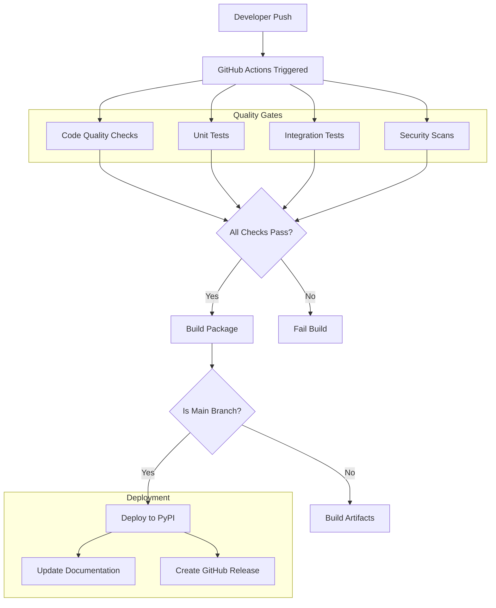

# CI/CD Pipeline

This document describes the Continuous Integration and Continuous Deployment pipeline for the Pyvider RPC Plugin project, including automated testing, code quality checks, and deployment processes.

## Overview

Our CI/CD pipeline is built on **GitHub Actions** and follows these principles:

- **Fast Feedback** - Quick validation of changes
- **Quality Gates** - Comprehensive testing and quality checks
- **Security First** - Security scanning at every stage
- **Automated Deployment** - Seamless releases to PyPI and documentation
- **Multi-Environment** - Testing across Python versions and platforms

## Pipeline Architecture



## GitHub Actions Workflows

### 1. Main CI Workflow

**.github/workflows/ci.yml**
```yaml
name: CI

on:
  push:
    branches: [ main, develop ]
  pull_request:
    branches: [ main, develop ]

jobs:
  quality:
    name: Code Quality
    runs-on: ubuntu-latest
    
    steps:
    - uses: actions/checkout@v4
    
    - name: Set up Python
      uses: actions/setup-python@v4
      with:
        python-version: '3.11'
    
    - name: Cache dependencies
      uses: actions/cache@v3
      with:
        path: ~/.cache/pip
        key: ${{ runner.os }}-pip-${{ hashFiles('**/requirements*.txt') }}
    
    - name: Install dependencies
      run: |
        python -m pip install --upgrade pip
        pip install -e ".[dev,test]"
    
    - name: Run ruff (formatting and linting)
      run: |
        ruff check .
        ruff format --check .
    
    - name: Run mypy (type checking)
      run: mypy src/
    
    - name: Check imports with isort
      run: isort --check-only --diff src/ tests/
    
    - name: Security scan with bandit
      run: bandit -r src/ -f json -o bandit-report.json
      continue-on-error: true
    
    - name: Upload security scan results
      uses: actions/upload-artifact@v3
      if: always()
      with:
        name: security-scan
        path: bandit-report.json

  test:
    name: Test Suite
    runs-on: ${{ matrix.os }}
    strategy:
      matrix:
        os: [ubuntu-latest, macOS-latest, windows-latest]
        python-version: ['3.11', '3.12']
    
    steps:
    - uses: actions/checkout@v4
    
    - name: Set up Python ${{ matrix.python-version }}
      uses: actions/setup-python@v4
      with:
        python-version: ${{ matrix.python-version }}
    
    - name: Install dependencies
      run: |
        python -m pip install --upgrade pip
        pip install -e ".[dev,test]"
    
    - name: Run unit tests
      run: |
        pytest tests/unit/ -v \
          --cov=src \
          --cov-report=xml \
          --cov-report=html \
          --junit-xml=test-results.xml
    
    - name: Run integration tests
      run: |
        pytest tests/integration/ -v \
          --junit-xml=integration-results.xml
      env:
        PYTHONPATH: src
    
    - name: Upload coverage to Codecov
      uses: codecov/codecov-action@v3
      if: matrix.python-version == '3.11' && matrix.os == 'ubuntu-latest'
      with:
        file: ./coverage.xml
        flags: unittests
        name: codecov-umbrella
    
    - name: Upload test results
      uses: actions/upload-artifact@v3
      if: always()
      with:
        name: test-results-${{ matrix.os }}-${{ matrix.python-version }}
        path: |
          test-results.xml
          integration-results.xml
          htmlcov/

  performance:
    name: Performance Tests
    runs-on: ubuntu-latest
    if: github.event_name == 'push'
    
    steps:
    - uses: actions/checkout@v4
    
    - name: Set up Python
      uses: actions/setup-python@v4
      with:
        python-version: '3.11'
    
    - name: Install dependencies
      run: |
        python -m pip install --upgrade pip
        pip install -e ".[dev,test,benchmark]"
    
    - name: Run performance tests
      run: |
        pytest tests/performance/ -v \
          --benchmark-json=benchmark.json \
          --benchmark-only
    
    - name: Store benchmark results
      uses: benchmark-action/github-action-benchmark@v1
      with:
        tool: 'pytest'
        output-file-path: benchmark.json
        github-token: ${{ secrets.GITHUB_TOKEN }}
        auto-push: true
        comment-on-alert: true
        alert-threshold: '200%'

  security:
    name: Security Scan
    runs-on: ubuntu-latest
    
    steps:
    - uses: actions/checkout@v4
    
    - name: Set up Python
      uses: actions/setup-python@v4
      with:
        python-version: '3.11'
    
    - name: Install dependencies
      run: |
        python -m pip install --upgrade pip
        pip install -e ".[dev]"
        pip install safety
    
    - name: Check for known vulnerabilities
      run: safety check --json --output safety-report.json
      continue-on-error: true
    
    - name: Run CodeQL Analysis
      uses: github/codeql-action/analyze@v2
      with:
        languages: python
    
    - name: Upload safety results
      uses: actions/upload-artifact@v3
      if: always()
      with:
        name: security-reports
        path: safety-report.json
```

### 2. Release Workflow

**.github/workflows/release.yml**
```yaml
name: Release

on:
  push:
    tags:
      - 'v*'

jobs:
  test:
    name: Run Tests
    uses: ./.github/workflows/ci.yml
  
  build:
    name: Build Distribution
    runs-on: ubuntu-latest
    needs: test
    
    steps:
    - uses: actions/checkout@v4
      with:
        fetch-depth: 0
    
    - name: Set up Python
      uses: actions/setup-python@v4
      with:
        python-version: '3.11'
    
    - name: Install build dependencies
      run: |
        python -m pip install --upgrade pip
        pip install build twine
    
    - name: Build package
      run: python -m build
    
    - name: Check package
      run: twine check dist/*
    
    - name: Upload artifacts
      uses: actions/upload-artifact@v3
      with:
        name: distributions
        path: dist/

  publish-pypi:
    name: Publish to PyPI
    runs-on: ubuntu-latest
    needs: build
    environment:
      name: pypi
      url: https://pypi.org/p/pyvider-rpcplugin
    
    permissions:
      id-token: write
    
    steps:
    - name: Download artifacts
      uses: actions/download-artifact@v3
      with:
        name: distributions
        path: dist/
    
    - name: Publish to PyPI
      uses: pypa/gh-action-pypi-publish@release/v1

  publish-docs:
    name: Update Documentation
    runs-on: ubuntu-latest
    needs: build
    
    steps:
    - uses: actions/checkout@v4
      with:
        fetch-depth: 0
    
    - name: Set up Python
      uses: actions/setup-python@v4
      with:
        python-version: '3.11'
    
    - name: Install dependencies
      run: |
        python -m pip install --upgrade pip
        pip install -e ".[docs]"
    
    - name: Configure Git user
      run: |
        git config --local user.email "action@github.com"
        git config --local user.name "GitHub Action"
    
    - name: Extract version
      id: version
      run: echo "version=${GITHUB_REF#refs/tags/v}" >> $GITHUB_OUTPUT
    
    - name: Deploy documentation
      run: |
        mike deploy --push --update-aliases ${{ steps.version.outputs.version }} latest
        mike set-default --push latest

  create-release:
    name: Create GitHub Release
    runs-on: ubuntu-latest
    needs: [publish-pypi, publish-docs]
    
    permissions:
      contents: write
    
    steps:
    - uses: actions/checkout@v4
      with:
        fetch-depth: 0
    
    - name: Download artifacts
      uses: actions/download-artifact@v3
      with:
        name: distributions
        path: dist/
    
    - name: Extract version
      id: version
      run: echo "version=${GITHUB_REF#refs/tags/v}" >> $GITHUB_OUTPUT
    
    - name: Generate changelog
      id: changelog
      run: |
        # Extract changelog for this version
        sed -n '/^## \[${{ steps.version.outputs.version }}\]/,/^## \[/p' CHANGELOG.md | \
        sed '$d' > release-notes.md
    
    - name: Create Release
      uses: actions/create-release@v1
      env:
        GITHUB_TOKEN: ${{ secrets.GITHUB_TOKEN }}
      with:
        tag_name: ${{ github.ref }}
        release_name: Release ${{ steps.version.outputs.version }}
        body_path: release-notes.md
        draft: false
        prerelease: false
    
    - name: Upload Release Assets
      uses: actions/upload-release-asset@v1
      env:
        GITHUB_TOKEN: ${{ secrets.GITHUB_TOKEN }}
      with:
        upload_url: ${{ steps.create_release.outputs.upload_url }}
        asset_path: dist/
        asset_name: distributions
        asset_content_type: application/zip
```

### 3. Documentation Workflow

**.github/workflows/docs.yml**
```yaml
name: Documentation

on:
  push:
    branches: [ main ]
    paths: 
      - 'docs/**'
      - 'mkdocs.yml'
      - 'src/**/*.py'
  
  pull_request:
    branches: [ main ]
    paths:
      - 'docs/**'
      - 'mkdocs.yml'

jobs:
  docs:
    name: Build Documentation
    runs-on: ubuntu-latest
    
    steps:
    - uses: actions/checkout@v4
      with:
        fetch-depth: 0
    
    - name: Set up Python
      uses: actions/setup-python@v4
      with:
        python-version: '3.11'
    
    - name: Install dependencies
      run: |
        python -m pip install --upgrade pip
        pip install -e ".[docs]"
    
    - name: Build documentation
      run: mkdocs build --strict
    
    - name: Test documentation links
      run: |
        pip install linkchecker
        linkchecker site/ --check-extern
    
    - name: Deploy to GitHub Pages (main branch only)
      if: github.ref == 'refs/heads/main'
      run: mkdocs gh-deploy --force
```

## Quality Gates

### 1. Code Quality Checks

**Ruff Configuration** (pyproject.toml)
```toml
[tool.ruff]
target-version = "py311"
line-length = 88
select = [
    "E",  # pycodestyle errors
    "W",  # pycodestyle warnings
    "F",  # pyflakes
    "I",  # isort
    "B",  # flake8-bugbear
    "C4", # flake8-comprehensions
    "UP", # pyupgrade
    "S",  # bandit (security)
]
ignore = [
    "E501", # line too long (handled by formatter)
    "B008", # do not perform function calls in argument defaults
]

[tool.ruff.per-file-ignores]
"tests/**/*.py" = ["S101"] # assert statements allowed in tests

[tool.ruff.isort]
known-first-party = ["pyvider"]
```

**MyPy Configuration** (pyproject.toml)
```toml
[tool.mypy]
python_version = "3.11"
warn_return_any = true
warn_unused_configs = true
disallow_untyped_defs = true
disallow_incomplete_defs = true
check_untyped_defs = true
disallow_untyped_decorators = true
no_implicit_optional = true
warn_redundant_casts = true
warn_unused_ignores = true
warn_no_return = true
warn_unreachable = true
strict_equality = true

[[tool.mypy.overrides]]
module = "tests.*"
disallow_untyped_defs = false
```

### 2. Test Coverage Requirements

**Pytest Configuration** (pyproject.toml)
```toml
[tool.pytest.ini_options]
testpaths = ["tests"]
python_files = ["test_*.py"]
python_classes = ["Test*"]
python_functions = ["test_*"]
addopts = [
    "--strict-markers",
    "--strict-config",
    "--verbose",
    "--cov-report=term-missing",
    "--cov-branch",
]
markers = [
    "unit: Unit tests",
    "integration: Integration tests",
    "performance: Performance tests",
    "slow: Slow tests",
]

[tool.coverage.run]
source = ["src"]
branch = true
omit = [
    "*/tests/*",
    "*/test_*.py",
    "*/__pycache__/*",
    "*/venv/*",
    "*/workenv/*",
]

[tool.coverage.report]
exclude_lines = [
    "pragma: no cover",
    "def __repr__",
    "if self.debug:",
    "if settings.DEBUG",
    "raise AssertionError",
    "raise NotImplementedError",
    "if 0:",
    "if __name__ == .__main__.:",
    "class .*\\bProtocol\\):",
    "@(abc\\.)?abstractmethod",
]
show_missing = true
skip_covered = false
```

### 3. Security Scanning

**Bandit Configuration** (.bandit)
```yaml
# Bandit security scanner configuration
skips: []
tests:
  - B101  # assert_used
  - B102  # exec_used
  - B103  # set_bad_file_permissions
  - B104  # hardcoded_bind_all_interfaces
  - B105  # hardcoded_password_string
  - B106  # hardcoded_password_funcarg
  - B107  # hardcoded_password_default
  - B108  # hardcoded_tmp_directory
  - B110  # try_except_pass
  - B112  # try_except_continue
  - B201  # flask_debug_true
  - B301  # pickle
  - B302  # marshal
  - B303  # md5
  - B304  # des
  - B305  # cipher
  - B306  # mktemp_q
  - B307  # eval
  - B308  # mark_safe
  - B309  # httpsconnection
  - B310  # urllib_urlopen
  - B311  # random
  - B312  # telnetlib
  - B313  # xml_bad_cElementTree
  - B314  # xml_bad_ElementTree
  - B315  # xml_bad_expatreader
  - B316  # xml_bad_expatbuilder
  - B317  # xml_bad_sax
  - B318  # xml_bad_minidom
  - B319  # xml_bad_pulldom
  - B320  # xml_bad_etree
  - B321  # ftplib
  - B322  # input
  - B323  # unverified_context
  - B324  # hashlib_new_insecure_functions
  - B325  # tempfile
  - B401  # import_telnetlib
  - B402  # import_ftplib
  - B403  # import_pickle
  - B404  # import_subprocess
  - B405  # import_xml_etree
  - B406  # import_xml_sax
  - B407  # import_xml_expat
  - B408  # import_xml_minidom
  - B409  # import_xml_pulldom
  - B410  # import_lxml
  - B411  # import_xmlrpclib
  - B412  # import_httpoxy
  - B413  # import_pycrypto
  - B501  # request_with_no_cert_validation
  - B502  # ssl_with_bad_version
  - B503  # ssl_with_bad_defaults
  - B504  # ssl_with_no_version
  - B505  # weak_cryptographic_key
  - B506  # yaml_load
  - B507  # ssh_no_host_key_verification
  - B601  # paramiko_calls
  - B602  # subprocess_popen_with_shell_equals_true
  - B603  # subprocess_without_shell_equals_true
  - B604  # any_other_function_with_shell_equals_true
  - B605  # start_process_with_a_shell
  - B606  # start_process_with_no_shell
  - B607  # start_process_with_partial_path
  - B608  # hardcoded_sql_expressions
  - B609  # linux_commands_wildcard_injection
  - B610  # django_extra_used
  - B611  # django_rawsql_used
  - B701  # jinja2_autoescape_false
  - B702  # use_of_mako_templates
  - B703  # django_mark_safe

exclude_dirs:
  - /tests/
  - /venv/
  - /workenv/
```

## Deployment Strategies

### 1. PyPI Deployment

**Package Configuration** (pyproject.toml)
```toml
[build-system]
requires = ["hatchling"]
build-backend = "hatchling.build"

[project]
name = "pyvider-rpcplugin"
dynamic = ["version"]
description = "High-performance, type-safe RPC plugin framework for Python"
readme = "README.md"
license = {text = "MIT"}
authors = [
    {name = "provide.io", email = "info@provide.io"},
]
classifiers = [
    "Development Status :: 4 - Beta",
    "Intended Audience :: Developers",
    "License :: OSI Approved :: MIT License",
    "Programming Language :: Python :: 3",
    "Programming Language :: Python :: 3.11",
    "Programming Language :: Python :: 3.12",
    "Topic :: Software Development :: Libraries :: Python Modules",
    "Topic :: System :: Networking",
]
requires-python = ">=3.11"
dependencies = [
    "grpcio>=1.50.0",
    "grpcio-tools>=1.50.0",
    "protobuf>=4.21.0",
    "asyncio-compat>=0.1.2",
    "provide-foundation>=0.6.0",
]

[project.optional-dependencies]
dev = [
    "ruff>=0.1.0",
    "mypy>=1.7.0",
    "black>=23.0.0",
    "isort>=5.12.0",
    "bandit>=1.7.0",
    "safety>=2.3.0",
]
test = [
    "pytest>=7.0.0",
    "pytest-cov>=4.0.0",
    "pytest-asyncio>=0.21.0",
    "pytest-mock>=3.10.0",
    "pytest-benchmark>=4.0.0",
]
docs = [
    "mkdocs>=1.5.0",
    "mkdocs-material>=9.0.0",
    "mkdocstrings[python]>=0.24.0",
    "mike>=2.0.0",
]

[project.urls]
Homepage = "https://rpcplugin.provide.io"
Documentation = "https://rpcplugin.provide.io"
Repository = "https://github.com/provide-io/pyvider-rpcplugin"
Changelog = "https://github.com/provide-io/pyvider-rpcplugin/blob/main/CHANGELOG.md"

[tool.hatch.version]
path = "src/pyvider/__init__.py"

[tool.hatch.build.targets.sdist]
include = [
    "/src",
    "/tests",
    "/docs",
    "/README.md",
    "/LICENSE",
    "/CHANGELOG.md",
]

[tool.hatch.build.targets.wheel]
packages = ["src/pyvider"]
```

### 2. Documentation Deployment

**MkDocs Configuration for CI** (mkdocs.yml additions)
```yaml
# Additional CI-specific configuration
plugins:
  - mkdocstrings:
      handlers:
        python:
          options:
            show_source: false  # Don't show source in deployed docs
  
  - mike:
      version_selector: true
      css_dir: css
      javascript_dir: js
      canonical_version: latest

# CI-specific features
extra:
  version:
    provider: mike
    default: stable
  
  analytics:
    provider: google
    property: G-XXXXXXXXXX
```

## Environment Management

### 1. Development Environment

**Development Setup Script** (scripts/setup-dev.sh)
```bash
#!/bin/bash
# Development environment setup

set -e

echo "🔧 Setting up development environment..."

# Ensure we're using the right Python version
if ! python3.11 --version &> /dev/null; then
    echo "❌ Python 3.11 not found. Please install Python 3.11+"
    exit 1
fi

# Setup virtual environment using workenv
echo "📁 Setting up virtual environment..."
source env.sh

# Install development dependencies
echo "📦 Installing dependencies..."
pip install --upgrade pip
pip install -e ".[dev,test,docs]"

# Install pre-commit hooks
echo "🪝 Installing pre-commit hooks..."
pre-commit install

# Setup Git hooks
echo "⚙️ Configuring Git hooks..."
cat > .git/hooks/pre-push << 'EOF'
#!/bin/bash
# Run tests before pushing
echo "🧪 Running tests before push..."
pytest tests/unit/ -x || exit 1
echo "✅ Tests passed!"
EOF

chmod +x .git/hooks/pre-push

echo "✅ Development environment ready!"
echo ""
echo "Next steps:"
echo "  1. Run 'pytest' to run tests"
echo "  2. Run 'mkdocs serve' to preview documentation"
echo "  3. Run 'ruff check .' to check code quality"
```

### 2. CI Environment Preparation

**CI Setup Script** (scripts/ci-setup.sh)
```bash
#!/bin/bash
# CI environment setup

set -e

echo "🤖 Setting up CI environment..."

# Install system dependencies
if [ "$RUNNER_OS" = "Linux" ]; then
    sudo apt-get update
    sudo apt-get install -y \
        build-essential \
        libssl-dev \
        libffi-dev \
        python3-dev
elif [ "$RUNNER_OS" = "macOS" ]; then
    brew update
    brew install openssl libffi
elif [ "$RUNNER_OS" = "Windows" ]; then
    choco install openssl
fi

# Setup Python environment
python -m pip install --upgrade pip wheel setuptools

# Install dependencies
pip install -e ".[dev,test]"

echo "✅ CI environment ready!"
```

## Monitoring and Alerting

### 1. Build Monitoring

**GitHub Actions Status Badges** (README.md)
```markdown
[](https://github.com/provide-io/pyvider-rpcplugin/actions/workflows/ci.yml)
[](https://codecov.io/gh/provide-io/pyvider-rpcplugin)
[](https://badge.fury.io/py/pyvider-rpcplugin)
[](https://pypi.org/project/pyvider-rpcplugin/)
```

### 2. Performance Regression Detection

**Performance Alert Configuration**
```yaml
# In performance test workflow
- name: Store benchmark results
  uses: benchmark-action/github-action-benchmark@v1
  with:
    tool: 'pytest'
    output-file-path: benchmark.json
    github-token: ${{ secrets.GITHUB_TOKEN }}
    auto-push: true
    comment-on-alert: true
    alert-threshold: '200%'  # Alert if performance degrades by 200%
    fail-on-alert: true      # Fail the build on regression
    alert-comment-cc-users: '@maintainer1,@maintainer2'
```

## Release Process

### 1. Automated Versioning

**Version Bump Script** (scripts/bump-version.sh)
```bash
#!/bin/bash
# Automated version bumping

set -e

BUMP_TYPE=${1:-patch}  # major, minor, patch
CURRENT_VERSION=$(python -c "import pyvider; print(pyvider.__version__)")

echo "📊 Current version: $CURRENT_VERSION"
echo "🔄 Bumping $BUMP_TYPE version..."

# Use semantic versioning
case $BUMP_TYPE in
    major)
        NEW_VERSION=$(echo $CURRENT_VERSION | awk -F. '{printf "%d.0.0", $1+1}')
        ;;
    minor)
        NEW_VERSION=$(echo $CURRENT_VERSION | awk -F. '{printf "%d.%d.0", $1, $2+1}')
        ;;
    patch)
        NEW_VERSION=$(echo $CURRENT_VERSION | awk -F. '{printf "%d.%d.%d", $1, $2, $3+1}')
        ;;
esac

echo "🎯 New version: $NEW_VERSION"

# Update version in code
sed -i "s/__version__ = \"$CURRENT_VERSION\"/__version__ = \"$NEW_VERSION\"/" src/pyvider/__init__.py

# Update CHANGELOG
sed -i "1s/^/## [$NEW_VERSION] - $(date +%Y-%m-%d)\n\n### Added\n\n### Changed\n\n### Fixed\n\n/" CHANGELOG.md

echo "✅ Version bumped to $NEW_VERSION"
echo "📝 Please update CHANGELOG.md with release notes"
```

### 2. Release Checklist

**Pre-release Checklist**
- [ ] All tests pass
- [ ] Documentation is up to date
- [ ] CHANGELOG.md is updated
- [ ] Version is bumped appropriately
- [ ] Security scan passes
- [ ] Performance benchmarks are within limits
- [ ] Breaking changes are documented

**Release Process**
1. Create release branch: `git checkout -b release/v1.2.3`
2. Update version: `scripts/bump-version.sh minor`
3. Update CHANGELOG.md with release notes
4. Commit changes: `git commit -am "Release v1.2.3"`
5. Create PR to main branch
6. After merge, create and push tag: `git tag v1.2.3 && git push origin v1.2.3`
7. GitHub Actions will handle the rest automatically

This comprehensive CI/CD pipeline ensures high code quality, comprehensive testing, and automated deployment while maintaining security and performance standards.