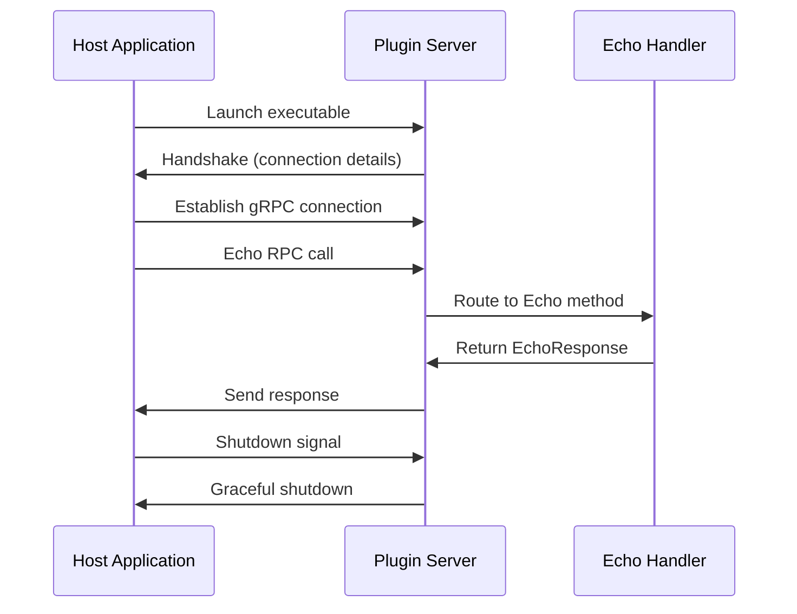

# Build Your First Plugin

Create a complete Echo plugin with custom RPC methods. This tutorial builds on the [Quick Start](quick-start.md) to show you how to implement a real service with Protocol Buffers and gRPC.

## What You'll Build

An Echo plugin that:
- Accepts text messages from the host application
- Returns modified echo responses
- Uses Protocol Buffers for type-safe communication
- Demonstrates proper plugin architecture patterns

## Prerequisites

- Completed [Quick Start](quick-start.md) 
- Python 3.11+ with `pyvider-rpcplugin` installed
- `grpcio-tools` for Protocol Buffer compilation

## Step 1: Define the Service Interface

First, create a Protocol Buffer definition that specifies your service interface.

Create `echo.proto`:

```protobuf
// echo.proto
syntax = "proto3";

package echo;

// The request message containing the text to echo
message EchoRequest {
  string message = 1;
}

// The response message containing the echoed text
message EchoResponse {
  string reply = 1;
}

// The service definition
service EchoService {
  rpc Echo(EchoRequest) returns (EchoResponse);
}
```

## Step 2: Generate Python Code

Compile the `.proto` file to generate Python classes:

```bash
# Install grpcio-tools if needed
pip install grpcio-tools

# Generate Python files
python -m grpc_tools.protoc \
    -I. \
    --python_out=. \
    --grpc_python_out=. \
    --pyi_out=. \
    echo.proto
```

This generates three files:
- `echo_pb2.py` - Message classes (`EchoRequest`, `EchoResponse`)
- `echo_pb2_grpc.py` - Service classes and registration functions
- `echo_pb2.pyi` - Type hints for better IDE support

## Step 3: Implement the Service Handler

Create `echo_handler.py` with your business logic:

```python
# echo_handler.py
import grpc
from echo_pb2 import EchoRequest, EchoResponse
from echo_pb2_grpc import EchoServiceServicer
from provide.foundation import logger

class EchoHandler(EchoServiceServicer):
    """Handler implementing the Echo service business logic."""
    
    async def Echo(
        self, 
        request: EchoRequest, 
        context: grpc.aio.ServicerContext
    ) -> EchoResponse:
        """Handle Echo RPC calls."""
        logger.info(f"📨 Received Echo request: '{request.message}'")
        
        # Your business logic here
        reply_message = f"Plugin echoed: {request.message}"
        
        logger.info(f"📤 Sending Echo response: '{reply_message}'")
        return EchoResponse(reply=reply_message)
```

## Step 4: Create the Protocol Bridge

Create `echo_protocol.py` to bridge your service with Pyvider RPC Plugin:

```python
# echo_protocol.py
from typing import Any
from pyvider.rpcplugin.protocol.base import RPCPluginProtocol
import echo_pb2_grpc
from provide.foundation import logger

class EchoProtocol(RPCPluginProtocol):
    """Protocol bridge for Echo service."""
    
    async def get_grpc_descriptors(self) -> tuple[Any, str]:
        """Return gRPC module and service name."""
        return echo_pb2_grpc, "echo.EchoService"
    
    def get_method_type(self, method_name: str) -> str:
        """Return the RPC method type."""
        if "Echo" in method_name:
            return "unary_unary"
        logger.warning(f"Unknown method {method_name}, defaulting to unary_unary")
        return "unary_unary"
    
    async def add_to_server(self, server: Any, handler: Any) -> None:
        """Register handler with the gRPC server."""
        echo_pb2_grpc.add_EchoServiceServicer_to_server(handler, server)
        logger.info("✅ Echo service registered with gRPC server")
```

## Step 5: Build the Plugin Server

Create `echo_plugin.py` as your main plugin executable:

```python
#!/usr/bin/env python3
# echo_plugin.py
"""
Echo plugin server - demonstrates custom RPC service implementation.
"""
import asyncio
import os
from pyvider.rpcplugin import plugin_server, rpcplugin_config
from provide.foundation import logger

# Import our custom components
from echo_handler import EchoHandler
from echo_protocol import EchoProtocol

async def main():
    logger.info("🚀 Starting Echo plugin server...")
    
    # Create handler and protocol
    handler = EchoHandler()
    protocol = EchoProtocol()
    
    # Create plugin server
    server = plugin_server(protocol=protocol, handler=handler)
    
    try:
        logger.info("🔌 Echo plugin ready to serve...")
        await server.serve()  # Handshake + serve requests
        logger.info("Echo plugin finished serving")
    except KeyboardInterrupt:
        logger.info("Echo plugin stopped by user")
    except Exception as e:
        logger.error(f"Echo plugin error: {e}", exc_info=True)
    finally:
        logger.info("Echo plugin shutting down")

if __name__ == "__main__":
    # For standalone testing - set magic cookie
    cookie_key = rpcplugin_config.magic_cookie_key()
    cookie_value = rpcplugin_config.magic_cookie_value()
    os.environ[cookie_key] = cookie_value
    
    asyncio.run(main())
```

## Step 6: Create the Host Application

Create `echo_host.py` to launch and use your plugin:

```python
#!/usr/bin/env python3
# echo_host.py
"""
Host application that uses the Echo plugin.
"""
import asyncio
import sys
from pathlib import Path
from pyvider.rpcplugin import plugin_client
from pyvider.rpcplugin.exception import RPCPluginError
from provide.foundation import logger

# Import generated gRPC client
from echo_pb2 import EchoRequest
from echo_pb2_grpc import EchoServiceStub

async def main():
    logger.info("🏠 Starting Echo host application...")
    
    # Define plugin command
    plugin_path = Path(__file__).parent / "echo_plugin.py"
    plugin_command = [sys.executable, str(plugin_path)]
    
    client = None
    try:
        logger.info("🚀 Launching Echo plugin...")
        
        # Create and start plugin client
        client = plugin_client(command=plugin_command)
        await client.start()
        
        logger.info("✅ Connected to Echo plugin!")
        
        # Create gRPC stub for making RPC calls
        stub = EchoServiceStub(client.grpc_channel)
        
        # Make some Echo calls
        test_messages = [
            "Hello, Plugin!",
            "How are you doing?",
            "This is a test message",
        ]
        
        for message in test_messages:
            logger.info(f"📨 Sending: '{message}'")
            
            # Make RPC call
            request = EchoRequest(message=message)
            response = await stub.Echo(request)
            
            logger.info(f"📤 Received: '{response.reply}'")
            logger.info("---")
        
        logger.info("🎉 All Echo calls completed successfully!")
        
    except RPCPluginError as e:
        logger.error(f"❌ Plugin error: {e.message}")
        if e.hint:
            logger.error(f"Hint: {e.hint}")
    except Exception as e:
        logger.error(f"❌ Unexpected error: {e}", exc_info=True)
    finally:
        if client:
            logger.info("🔌 Shutting down plugin...")
            await client.close()
            logger.info("Shutdown complete")

if __name__ == "__main__":
    asyncio.run(main())
```

## Step 7: Test Your Plugin

Run your complete Echo plugin system:

```bash
python echo_host.py
```

Expected output:

```
2024-01-15 10:30:45.123 [info     ] 🏠 Starting Echo host application...
2024-01-15 10:30:45.124 [info     ] 🚀 Launching Echo plugin...
2024-01-15 10:30:45.200 [info     ] 🚀 Starting Echo plugin server...
2024-01-15 10:30:45.201 [info     ] ✅ Echo service registered with gRPC server
2024-01-15 10:30:45.202 [info     ] 🔌 Echo plugin ready to serve...
2024-01-15 10:30:45.250 [info     ] ✅ Connected to Echo plugin!
2024-01-15 10:30:45.251 [info     ] 📨 Sending: 'Hello, Plugin!'
2024-01-15 10:30:45.252 [info     ] 📨 Received Echo request: 'Hello, Plugin!'
2024-01-15 10:30:45.253 [info     ] 📤 Sending Echo response: 'Plugin echoed: Hello, Plugin!'
2024-01-15 10:30:45.254 [info     ] 📤 Received: 'Plugin echoed: Hello, Plugin!'
2024-01-15 10:30:45.255 [info     ] ---
... (more messages)
2024-01-15 10:30:45.300 [info     ] 🎉 All Echo calls completed successfully!
2024-01-15 10:30:45.301 [info     ] 🔌 Shutting down plugin...
2024-01-15 10:30:45.302 [info     ] Shutdown complete
```

🎉 **Success!** You've built a complete plugin with custom RPC methods!

## Understanding the Architecture

### Key Components

1. **Protocol Buffers** (`.proto` file)
   - Defines service interface and message types
   - Language-agnostic schema
   - Generates type-safe Python code

2. **Service Handler** 
   - Implements business logic
   - Inherits from generated servicer class
   - Async methods for performance

3. **Protocol Bridge**
   - Connects your service to Pyvider RPC Plugin
   - Provides service metadata to the framework
   - Handles registration with gRPC server

4. **Plugin Server**
   - Main executable launched by host
   - Manages handshake and connection lifecycle
   - Serves RPC requests

5. **Host Application**
   - Launches and manages plugin process
   - Creates gRPC client stubs
   - Makes RPC calls to plugin

### Data Flow



## Next Steps

Now that you understand the plugin architecture:

### 📝 Quick Reference Examples

For focused, executable examples (15-30 lines each):

- **[Basic Server](../examples/short/basic-server.md)** - Minimal factory-based server
- **[Health Checks](../examples/short/health-check.md)** - Health monitoring integration  
- **[Rate Limiting](../examples/short/rate-limiting.md)** - Request throttling patterns
- **[Custom Protocol](../examples/short/custom-protocol.md)** - Like the Echo example above

### 📚 Learn More

- **[Core Concepts](../guide/concepts/)** - Deep dive into architecture
- **[Security](../guide/concepts/security.md)** - Enable mTLS for production
- **[Transports](../guide/concepts/transports.md)** - Unix vs TCP sockets
- **[Configuration](../guide/concepts/configuration.md)** - Environment variables and settings

### 🛠️ Practical Guides

- **[Server Development](../guide/server/)** - Advanced server patterns
- **[Client Development](../guide/client/)** - Connection management and retry logic
- **[Error Handling](../guide/error-handling/)** - Robust error handling patterns
- **[Testing](../guide/testing/)** - Unit and integration testing strategies

### 🚀 Advanced Topics

- **[Async Patterns](../guide/async-patterns/)** - Stream processing and concurrency
- **[Performance](../guide/performance/)** - Optimization and benchmarking
- **[Production Deployment](../guide/production/)** - Scaling and monitoring

## Common Issues

### Import Errors
```bash
# Make sure generated files are in Python path
export PYTHONPATH="${PYTHONPATH}:$(pwd)"

# Or move generated files to a package directory
mkdir echo_service
mv echo_pb2* echo_service/
touch echo_service/__init__.py
```

### Protocol Compilation Issues
```bash
# Install/upgrade protobuf compiler
pip install --upgrade grpcio-tools

# Check protoc version
python -m grpc_tools.protoc --version
```

### Connection Timeouts
```bash
# Check if plugin starts successfully
python echo_plugin.py

# Verify handshake output format
# Should print connection details to stdout
```

Ready to explore more advanced features? Check out the [User Guide](../guide/) for comprehensive documentation!