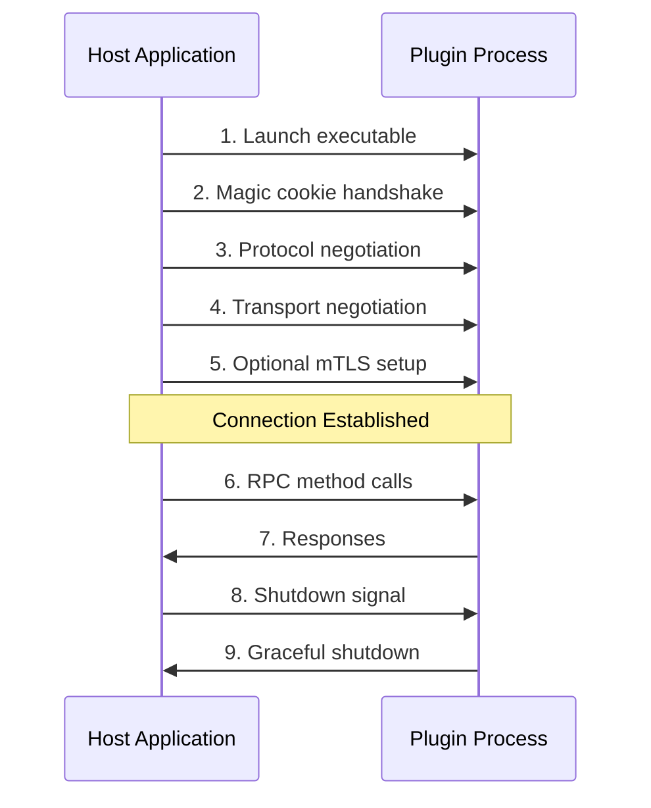

# Core Concepts

Understanding the fundamental concepts behind Pyvider RPC Plugin will help you build more effective and secure plugin systems. This section covers the essential architecture, components, and patterns.

## Overview

Pyvider RPC Plugin enables **process-based plugin architectures** where plugins run as separate processes and communicate via RPC (Remote Procedure Call). This approach provides isolation, security, and language flexibility while maintaining high performance.

## Key Components

### **Plugin vs Host Application**

<div class="rpc-important">
The plugin architecture separates concerns between the **Host Application** (your main program) and **Plugin Processes** (separate executables that provide specific functionality).
</div>

- **🏠 Host Application (Client)**: The main application that launches, manages, and communicates with plugins. Uses `RPCPluginClient` to initiate connections.
- **🔌 Plugin Process (Server)**: An external executable that provides specific services. Uses `RPCPluginServer` to serve RPC requests.
- **📡 RPC Communication**: gRPC-based communication allows the host to call plugin functions as if they were local.

### **Core Classes**

| Class | Role | Description |
|-------|------|-------------|
| `RPCPluginClient` | Host Application | Manages plugin lifecycle and RPC communication |
| `RPCPluginServer` | Plugin Process | Serves RPC requests from the host |
| `RPCPluginProtocol` | Both | Defines the RPC interface and service methods |
| `Handler/Servicer` | Plugin Process | Implements the actual business logic |

## Architecture Flow



## Essential Concepts

### 🤝 **Handshake Process**

The handshake is a critical security and compatibility check that occurs when the host connects to a plugin:

1. **Magic Cookie Authentication**: A shared secret passed via environment variable ensures the host is launching a trusted plugin
2. **Protocol Version Negotiation**: Client and server agree on a compatible RPC protocol version
3. **Transport Negotiation**: Agreement on communication method (Unix sockets or TCP)
4. **Optional mTLS Exchange**: Certificate exchange and verification for encrypted communication

### 🌐 **Transport Layer**

Communication between host and plugin happens over different transport mechanisms:

<div class="transport-badge unix">Unix Sockets</div>
**Best for**: Local IPC, high performance, security
**Platforms**: Linux, macOS
**Use case**: Same-machine plugin communication

<div class="transport-badge tcp">TCP Sockets</div>
**Best for**: Network communication, Windows compatibility  
**Platforms**: Linux, macOS, Windows
**Use case**: Remote plugins, Windows environments

### 📋 **Protocol Definition**

`RPCPluginProtocol` defines the interface between host and plugin:

```python
class MyProtocol(RPCPluginProtocol):
    async def get_grpc_descriptors(self):
        """Return Protocol Buffer descriptors and service name"""
        return my_pb2.DESCRIPTOR, "MyService"
    
    async def add_to_server(self, server, handler):
        """Add your service implementation to the gRPC server"""
        my_pb2_grpc.add_MyServiceServicer_to_server(handler, server)
```

### 🏗️ **Service Implementation**

The handler/servicer implements your actual business logic:

```python
class MyServiceHandler(my_pb2_grpc.MyServiceServicer):
    async def MyMethod(self, request, context):
        """Implement your RPC method"""
        result = process_request(request)
        return my_pb2.MyResponse(result=result)
```

## Security Model

### 🔒 **Process Isolation**

Each plugin runs in its own process, providing:
- **Memory isolation**: Plugin crashes don't affect the host
- **Resource limits**: OS-level resource management
- **Security boundaries**: Plugins can't directly access host memory

### 🔐 **mTLS Authentication**

Mutual TLS provides strong authentication and encryption:
- **Certificate-based auth**: Both host and plugin verify each other's certificates
- **Encrypted communication**: All RPC traffic is encrypted
- **Certificate management**: Built-in utilities for certificate generation and rotation

### 🍪 **Magic Cookie Validation**

A simple but effective security mechanism:
- **Shared secret**: Environment variable contains a secret value
- **Launch verification**: Ensures only trusted executables can connect
- **No network exposure**: Secret is passed via environment, not network

## Configuration Architecture

Pyvider RPC Plugin uses [provide.foundation](https://foundation.provide.io) for configuration:

```python
from pyvider.rpcplugin.config import rpcplugin_config

# Access configuration
timeout = rpcplugin_config.plugin_handshake_timeout
transports = rpcplugin_config.plugin_server_transports
mtls_enabled = rpcplugin_config.plugin_auto_mtls
```

Configuration sources (in priority order):
1. **Environment variables** (highest priority)
2. **Configuration files** (YAML, JSON, TOML)
3. **Programmatic settings**
4. **Default values** (lowest priority)

## Error Handling

Structured exception hierarchy provides predictable error handling:

```python
from pyvider.rpcplugin.exception import (
    RPCPluginError,     # Base exception
    TransportError,     # Network/transport issues
    HandshakeError,     # Handshake failures  
    SecurityError,      # Authentication/authorization
    ConfigError,        # Configuration problems
)
```

## Async/Await Integration

All APIs are async-first for maximum performance:

```python
# Server
async def main():
    server = plugin_server(protocol=MyProtocol(), handler=MyHandler())
    await server.serve()

# Client  
async def main():
    async with plugin_client() as client:
        result = await client.call_method("my_method", param="value")
```

## What's Next?

Now that you understand the core concepts, dive deeper into specific areas:

<div class="grid cards" markdown>

-   :material-sitemap: **RPC Architecture**
    
    ---
    
    Deep dive into the plugin architecture and communication patterns
    
    [:octicons-arrow-right-24: Learn Architecture](rpc-architecture.md)

-   :material-swap-horizontal: **Transports**
    
    ---
    
    Understanding Unix sockets vs TCP and when to use each
    
    [:octicons-arrow-right-24: Explore Transports](transports.md)

-   :material-api: **Protocols**
    
    ---
    
    How to define and implement RPC protocols with gRPC
    
    [:octicons-arrow-right-24: Define Protocols](protocols.md)

-   :material-shield-check: **Security Model**
    
    ---
    
    Comprehensive security including mTLS, magic cookies, and isolation
    
    [:octicons-arrow-right-24: Secure Plugins](security.md)

</div>

Or jump to practical implementation:

- **[Server Development](../server/index.md)** - Build your first plugin server
- **[Client Development](../client/index.md)** - Connect to and manage plugins