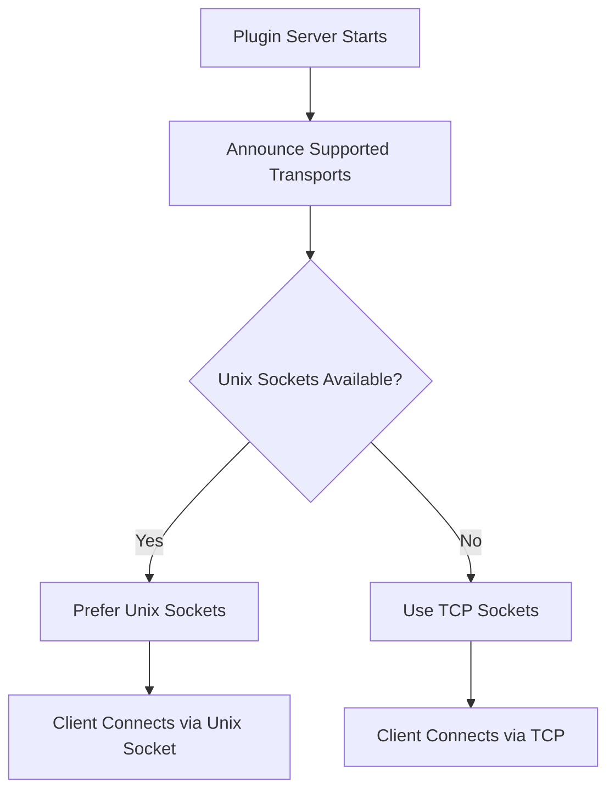

# Transports

Pyvider RPC Plugin supports multiple transport layers for communication between host applications and plugin processes. Each transport provides different trade-offs between performance, security, and platform compatibility.

## Transport Types

### 🔌 Unix Domain Sockets (UDS)

<div class="transport-badge unix">Recommended for local communication</div>

Unix Domain Sockets provide the highest performance for Inter-Process Communication (IPC) on the same machine.

**Advantages:**
- **Maximum Performance** - Bypasses network stack overhead
- **Lower Latency** - Direct kernel-to-kernel communication
- **File System Permissions** - Leverage OS security models
- **Resource Efficient** - Minimal CPU and memory overhead

**Limitations:**
- **Same Host Only** - Cannot communicate across network
- **Path Length Limits** - Some systems restrict socket path length
- **Platform Support** - Not available on Windows (yet)

**Best For:**
- High-performance local plugins
- Security-sensitive applications
- Resource-constrained environments
- Production systems with co-located processes

### 🌐 TCP Sockets

<div class="transport-badge tcp">Universal compatibility</div>

TCP sockets enable network communication, allowing plugins to run on different machines.

**Advantages:**
- **Network Communication** - Plugins can run on remote hosts
- **Universal Support** - Works on all platforms (Linux, macOS, Windows)
- **Standard Protocol** - Well-understood networking model
- **Firewall Friendly** - Standard port-based communication

**Limitations:**
- **Higher Overhead** - Network stack processing even for localhost
- **Port Management** - Requires available ports and conflict resolution
- **Security Considerations** - Network exposure requires additional security

**Best For:**
- Distributed plugin architectures
- Windows environments
- Cross-machine communication
- Development and testing scenarios

## Transport Selection

### Automatic Negotiation

Pyvider RPC Plugin automatically selects the best available transport:



### Configuration

Control transport selection through configuration:

```python
from pyvider.rpcplugin.config import rpcplugin_config

# View available transports
transports = rpcplugin_config.server_transports()
print(f"Available transports: {transports}")  # ['unix', 'tcp']

# Force specific transport
from pyvider.rpcplugin import configure

configure(transports=["tcp"])  # TCP only
configure(transports=["unix"])  # Unix only
configure(transports=["unix", "tcp"])  # Both, prefer unix
```

### Environment Variables

```bash
# Prefer TCP for development
export PYVIDER_RPC_SERVER_TRANSPORTS="tcp,unix"

# Unix only for production
export PYVIDER_RPC_SERVER_TRANSPORTS="unix"

# Custom TCP port
export PYVIDER_RPC_TCP_PORT="8080"

# Custom Unix socket path
export PYVIDER_RPC_UNIX_SOCKET_PATH="/tmp/my-plugin.sock"
```

## Implementation Details

### Unix Socket Transport

```python
from pyvider.rpcplugin.transport import UnixSocketTransport
import tempfile

# Create unix socket transport
with tempfile.NamedTemporaryFile(suffix=".sock", delete=False) as tmp:
    socket_path = tmp.name

transport = UnixSocketTransport(path=socket_path)

# Use with plugin server
server = plugin_server(protocol=my_protocol, handler=my_handler, transport=transport)
```

**Socket Path Management:**
- Automatic cleanup on server shutdown
- Collision detection and resolution
- Filesystem permission handling

### TCP Socket Transport

```python
from pyvider.rpcplugin.transport import TCPSocketTransport

# Create TCP transport
transport = TCPSocketTransport(host="127.0.0.1", port=0)  # port=0 for auto-assignment

# Use with plugin server
server = plugin_server(protocol=my_protocol, handler=my_handler, transport=transport)
```

**Port Management:**
- Automatic port assignment (port=0)
- Port collision detection
- Configurable host binding

## Platform Considerations

### Linux

All transport types fully supported:

```python
# Preferred configuration for Linux
configure(transports=["unix", "tcp"])  # Unix preferred, TCP fallback
```

### macOS

All transport types fully supported:

```python
# Preferred configuration for macOS  
configure(transports=["unix", "tcp"])  # Unix preferred, TCP fallback
```

### Windows

Unix sockets not yet supported:

```python
# Windows configuration
configure(transports=["tcp"])  # TCP only
```

!!! note "Windows Unix Socket Support"
    Windows 10+ supports Unix sockets, but Pyvider RPC Plugin doesn't yet leverage this. Support is planned for future releases using named pipes.

## Performance Characteristics

### Benchmark Results

| Transport | Throughput | Latency | CPU Usage | Memory |
|-----------|------------|---------|-----------|--------|
| Unix Socket | **~45,000 msg/sec** | **~0.02ms** | Low | Low |
| TCP (localhost) | ~35,000 msg/sec | ~0.03ms | Medium | Medium |
| TCP (network) | Varies by network | Varies by network | Medium | Medium |

### Optimization Tips

**For Unix Sockets:**
```python
# Use larger buffer sizes for high throughput
configure(unix_socket_buffer_size=65536)

# Optimize socket permissions
configure(unix_socket_permissions=0o600)
```

**For TCP Sockets:**
```python
# Use TCP_NODELAY for low latency
configure(tcp_nodelay=True)

# Optimize buffer sizes
configure(tcp_buffer_size=65536)

# Bind to specific interfaces in production
configure(tcp_host="192.168.1.100")
```

## Security Considerations

### Unix Socket Security

- **File Permissions** - Leverage filesystem ACLs
- **Path Location** - Use secure temporary directories
- **Cleanup** - Ensure socket files are removed on shutdown

```python
# Secure unix socket configuration
configure(
    unix_socket_path="/var/run/myapp/plugin.sock",
    unix_socket_permissions=0o600,  # Owner read/write only
    unix_socket_cleanup=True
)
```

### TCP Socket Security

- **Bind Address** - Use 127.0.0.1 for localhost only
- **Port Range** - Use non-privileged ports (>1024)
- **mTLS** - Enable mutual TLS for authentication

```python
# Secure TCP configuration
configure(
    tcp_host="127.0.0.1",  # Localhost only
    tcp_port_range=(8000, 9000),  # Specific port range
    auto_mtls=True  # Enable mTLS
)
```

## Common Patterns

### Development vs Production

**Development Configuration:**
```python
# Easy debugging and cross-platform compatibility
configure(
    transports=["tcp"],
    tcp_host="127.0.0.1",
    log_transport_details=True
)
```

**Production Configuration:**
```python
# Maximum performance and security
configure(
    transports=["unix"],
    unix_socket_path="/var/run/myapp/plugin.sock",
    unix_socket_permissions=0o600,
    auto_mtls=True
)
```

### Transport Fallback

```python
# Graceful degradation
configure(transports=["unix", "tcp"])  # Try unix first, fallback to TCP

# Handle transport failures
try:
    server = plugin_server(protocol=protocol, handler=handler)
    await server.serve()
except TransportError as e:
    logger.error(f"Transport failed: {e}")
    # Implement fallback strategy
```

## Troubleshooting

### Common Unix Socket Issues

**Permission Denied**
```bash
# Check socket file permissions
ls -la /path/to/socket.sock

# Fix permissions
chmod 600 /path/to/socket.sock
```

**Address Already in Use**
```bash
# Find processes using the socket
lsof /path/to/socket.sock

# Remove stale socket files
rm /path/to/socket.sock
```

### Common TCP Issues

**Port Already in Use**
```bash
# Find what's using the port
netstat -tulpn | grep :8080
lsof -i :8080

# Use automatic port assignment
configure(tcp_port=0)  # Let OS choose available port
```

**Connection Refused**
```bash
# Check if server is listening
netstat -tulpn | grep :8080

# Verify firewall settings
sudo ufw status
```

## Transport Architecture

### Transport Interface

All transports implement the `RPCPluginTransport` interface:

```python
from abc import ABC, abstractmethod
import asyncio

class RPCPluginTransport(ABC):
    """Base interface for all plugin transports."""
    
    @abstractmethod
    async def start_server(self, host: str, port: int) -> dict:
        """Start server and return connection details."""
        pass
    
    @abstractmethod
    async def connect_client(self, connection_info: dict) -> tuple:
        """Connect client and return reader/writer streams."""
        pass
    
    @abstractmethod
    async def close(self):
        """Clean up transport resources."""
        pass
    
    @abstractmethod
    def supports_feature(self, feature: str) -> bool:
        """Check if transport supports a specific feature."""
        pass
```

### Dynamic Transport Selection

```python
class TransportManager:
    """Manages multiple transports and selects optimal one."""
    
    def __init__(self):
        self.available_transports = {}
        self.preferred_order = ["unix", "tcp_mtls", "tcp"]
    
    def register_transport(self, name: str, transport: RPCPluginTransport):
        """Register a transport implementation."""
        self.available_transports[name] = transport
    
    async def select_transport(self, requirements: dict) -> RPCPluginTransport:
        """Select best transport based on requirements."""
        
        # Check security requirements
        security_level = requirements.get("security", "medium")
        network_required = requirements.get("network", False)
        performance_priority = requirements.get("performance", "balanced")
        
        # Score transports based on requirements
        transport_scores = {}
        
        for name, transport in self.available_transports.items():
            score = 0
            
            # Security scoring
            if security_level == "high":
                if name == "unix":
                    score += 10  # Unix sockets are most secure
                elif name == "tcp_mtls":
                    score += 8   # mTLS is very secure
                elif name == "tcp":
                    score += 3   # Plain TCP is less secure
            
            # Network requirement
            if network_required:
                if name.startswith("tcp"):
                    score += 10  # TCP supports network
                else:
                    score = 0    # Unix sockets don't support network
            
            # Performance scoring
            if performance_priority == "high":
                if name == "unix":
                    score += 10  # Unix sockets are fastest
                elif name == "tcp":
                    score += 6   # Plain TCP is faster than mTLS
                elif name == "tcp_mtls":
                    score += 4   # mTLS has encryption overhead
            
            transport_scores[name] = score
        
        # Select highest scoring transport
        if not transport_scores:
            raise TransportError("No suitable transport available")
        
        best_transport = max(transport_scores.items(), key=lambda x: x[1])
        logger.info(f"Selected transport: {best_transport[0]} (score: {best_transport[1]})")
        
        return self.available_transports[best_transport[0]]
```

## Advanced Unix Socket Features

### Enhanced Security with Process Validation

```python
import os
import socket
import struct
from pathlib import Path

class SecureUnixSocketTransport:
    def __init__(self, socket_path: Path | None = None, 
                 permissions: int = 0o600):
        self.socket_path = socket_path or self.generate_socket_path()
        self.permissions = permissions
        self.allowed_processes = set()
        self.server = None
    
    async def handle_connection(self, reader: asyncio.StreamReader,
                              writer: asyncio.StreamWriter):
        """Handle incoming Unix socket connection with peer validation."""
        try:
            # Get peer credentials for additional security
            sock = writer.transport.get_extra_info('socket')
            peer_creds = sock.getsockopt(socket.SOL_SOCKET, socket.SO_PEERCRED, 16)
            pid, uid, gid = struct.unpack('3i', peer_creds)
            
            # Verify peer process credentials
            if not self.validate_peer_credentials(pid, uid, gid):
                writer.close()
                await writer.wait_closed()
                return
            
            # Continue with handshake
            await self.perform_handshake(reader, writer)
            
        except Exception as e:
            logger.error(f"Unix socket connection error: {e}")
            writer.close()
            await writer.wait_closed()
    
    def validate_peer_credentials(self, pid: int, uid: int, gid: int) -> bool:
        """Enhanced credential validation."""
        # Check if connecting process has same UID (same user)
        current_uid = os.getuid()
        if uid != current_uid:
            logger.warning(f"Connection from different UID: {uid} != {current_uid}")
            return False
        
        # Process allowlist check
        if self.allowed_processes and pid not in self.allowed_processes:
            logger.warning(f"Process {pid} not in allowlist")
            return False
        
        # Additional process validation
        try:
            # Check if process still exists
            os.kill(pid, 0)
            
            # Validate process command line (basic check)
            with open(f"/proc/{pid}/cmdline", "rb") as f:
                cmdline = f.read().decode().replace('\0', ' ')
                if "python" not in cmdline.lower():
                    logger.warning(f"Unexpected process command: {cmdline}")
                    return False
        
        except (OSError, FileNotFoundError):
            logger.warning(f"Could not validate process {pid}")
            return False
        
        return True
```

## Advanced TCP Features with mTLS

### Full mTLS Implementation

```python
import ssl
from provide.foundation.crypto import Certificate

class MtlsTcpTransport:
    def __init__(self, server_cert: Certificate, client_cert: Certificate):
        self.server_cert = server_cert
        self.client_cert = client_cert
        self.server = None
    
    def create_server_ssl_context(self) -> ssl.SSLContext:
        """Create SSL context for server with mTLS."""
        context = ssl.create_default_context(ssl.Purpose.CLIENT_AUTH)
        
        # Load server certificate and key
        context.load_cert_chain(
            certfile=self.server_cert.cert_path,
            keyfile=self.server_cert.key_path
        )
        
        # Require client certificates
        context.verify_mode = ssl.CERT_REQUIRED
        
        # Load CA cert to validate clients
        context.load_verify_locations(cafile=self.client_cert.cert_path)
        
        # Use strong protocols and ciphers
        context.minimum_version = ssl.TLSVersion.TLSv1_3
        context.set_ciphers("ECDHE+AESGCM:ECDHE+CHACHA20:DHE+AESGCM:DHE+CHACHA20:!aNULL:!MD5:!DSS")
        
        return context
    
    def create_client_ssl_context(self) -> ssl.SSLContext:
        """Create SSL context for client with mTLS."""
        context = ssl.create_default_context(ssl.Purpose.SERVER_AUTH)
        
        # Load client certificate and key
        context.load_cert_chain(
            certfile=self.client_cert.cert_path,
            keyfile=self.client_cert.key_path
        )
        
        # Load CA cert to validate server
        context.load_verify_locations(cafile=self.server_cert.cert_path)
        
        # Disable hostname checking for self-signed certs
        context.check_hostname = False
        
        # Use strong protocols
        context.minimum_version = ssl.TLSVersion.TLSv1_3
        
        return context
    
    async def start_server(self, host: str, port: int) -> dict:
        """Start mTLS TCP server."""
        ssl_context = self.create_server_ssl_context()
        
        self.server = await asyncio.start_server(
            self.handle_connection,
            host, port,
            ssl=ssl_context
        )
        
        # Get actual bound address
        server_host, server_port = self.server.sockets[0].getsockname()
        
        return {
            "transport": "tcp_mtls",
            "host": server_host,
            "port": server_port,
            "tls_version": "1.3"
        }
    
    async def handle_connection(self, reader: asyncio.StreamReader,
                              writer: asyncio.StreamWriter):
        """Handle mTLS connection with certificate validation."""
        try:
            # Get connection info
            peer_addr = writer.transport.get_extra_info('peername')
            peer_cert = writer.transport.get_extra_info('peercert')
            
            if not peer_cert:
                logger.error("mTLS enabled but no client certificate")
                writer.close()
                await writer.wait_closed()
                return
            
            # Validate certificate
            if not self.validate_client_certificate(peer_cert):
                writer.close()
                await writer.wait_closed()
                return
            
            logger.info(f"mTLS connection from {peer_addr}")
            await self.perform_handshake(reader, writer)
            
        except Exception as e:
            logger.error(f"mTLS connection error: {e}")
            writer.close()
            await writer.wait_closed()
    
    def validate_client_certificate(self, cert_dict: dict) -> bool:
        """Comprehensive certificate validation."""
        try:
            # Basic certificate validation
            subject = dict(x[0] for x in cert_dict['subject'])
            issuer = dict(x[0] for x in cert_dict['issuer'])
            
            # Check certificate hasn't expired
            not_after = cert_dict.get('notAfter')
            if not_after:
                from datetime import datetime
                expiry_date = datetime.strptime(not_after, '%b %d %H:%M:%S %Y %Z')
                if datetime.utcnow() > expiry_date:
                    logger.error("Client certificate expired")
                    return False
            
            # Check certificate chain
            if not self.verify_certificate_chain(cert_dict):
                logger.error("Certificate chain validation failed")
                return False
            
            logger.info(f"Validated client certificate: {subject}")
            return True
            
        except Exception as e:
            logger.error(f"Certificate validation error: {e}")
            return False
    
    def verify_certificate_chain(self, cert_dict: dict) -> bool:
        """Verify certificate chain integrity."""
        # Implementation would verify the full certificate chain
        # This is a simplified version
        return True
```

### Connection Pooling for High Throughput

```python
class PooledTcpTransport:
    """TCP transport with connection pooling for high throughput."""
    
    def __init__(self, pool_size: int = 10, **kwargs):
        self.pool_size = pool_size
        self.connection_pool = asyncio.Queue(maxsize=pool_size)
        self.active_connections = 0
        self.connection_stats = {
            "created": 0,
            "reused": 0,
            "errors": 0
        }
    
    async def get_pooled_connection(self, connection_info: dict):
        """Get connection from pool or create new one."""
        try:
            # Try to get existing connection from pool
            reader, writer = await asyncio.wait_for(
                self.connection_pool.get(), timeout=1.0
            )
            
            # Test connection is still alive
            if not writer.transport.is_closing():
                self.connection_stats["reused"] += 1
                return reader, writer
            else:
                # Connection is dead, create new one
                await writer.wait_closed()
                
        except asyncio.TimeoutError:
            # No pooled connection available
            pass
        
        # Create new connection if under pool limit
        if self.active_connections < self.pool_size:
            reader, writer = await self.connect_client(connection_info)
            self.active_connections += 1
            self.connection_stats["created"] += 1
            return reader, writer
        
        # Wait for pooled connection
        reader, writer = await self.connection_pool.get()
        self.connection_stats["reused"] += 1
        return reader, writer
    
    async def return_pooled_connection(self, reader, writer):
        """Return connection to pool."""
        if not writer.transport.is_closing():
            try:
                await self.connection_pool.put((reader, writer))
            except asyncio.QueueFull:
                # Pool is full, close connection
                writer.close()
                await writer.wait_closed()
                self.active_connections -= 1
        else:
            self.active_connections -= 1
    
    def get_pool_stats(self) -> dict:
        """Get connection pool statistics."""
        return {
            "pool_size": self.pool_size,
            "active_connections": self.active_connections,
            "available_connections": self.connection_pool.qsize(),
            "stats": self.connection_stats
        }
```

## Performance Optimization

### Transport-Specific Optimizations

```python
class OptimizedTransportFactory:
    """Factory for creating performance-optimized transports."""
    
    @staticmethod
    def create_high_performance_unix() -> UnixSocketTransport:
        """Create Unix transport optimized for maximum performance."""
        transport = UnixSocketTransport()
        
        # Optimize socket buffer sizes
        transport.send_buffer_size = 1024 * 1024  # 1MB
        transport.recv_buffer_size = 1024 * 1024  # 1MB
        
        # Use memory-mapped I/O if available
        transport.use_mmap = True
        
        # Disable Nagle-like algorithms
        transport.tcp_nodelay = True
        
        return transport
    
    @staticmethod
    def create_high_throughput_tcp() -> PooledTcpTransport:
        """Create TCP transport optimized for high throughput."""
        return PooledTcpTransport(
            pool_size=50,
            enable_mtls=False,  # Less overhead for throughput
            tcp_nodelay=True,
            send_buffer_size=4 * 1024 * 1024,  # 4MB
            recv_buffer_size=4 * 1024 * 1024,  # 4MB
            keepalive=True,
            keepalive_idle=30,
            keepalive_interval=10,
            keepalive_count=3
        )
```

### Performance Monitoring

```python
import time
from dataclasses import dataclass

@dataclass
class TransportMetrics:
    connection_count: int = 0
    bytes_sent: int = 0
    bytes_received: int = 0
    connection_errors: int = 0
    avg_latency: float = 0.0
    peak_throughput: float = 0.0

class TransportPerformanceMonitor:
    def __init__(self):
        self.metrics = TransportMetrics()
        self.latency_samples = []
        self.throughput_samples = []
    
    async def measure_transport_performance(self, transport, duration: float = 60.0):
        """Comprehensive transport performance measurement."""
        start_time = time.time()
        
        while time.time() - start_time < duration:
            measurement_start = time.time()
            
            try:
                # Perform test connection
                conn_info = await transport.start_server("127.0.0.1", 0)
                reader, writer = await transport.connect_client(conn_info)
                
                # Measure latency
                latency = time.time() - measurement_start
                self.latency_samples.append(latency)
                
                # Test throughput with sample data
                test_data = b"x" * 1024  # 1KB test message
                throughput_start = time.time()
                
                for _ in range(100):  # Send 100KB
                    writer.write(test_data)
                    await writer.drain()
                
                throughput_time = time.time() - throughput_start
                throughput = (100 * 1024) / throughput_time  # Bytes per second
                self.throughput_samples.append(throughput)
                
                # Clean up
                writer.close()
                await writer.wait_closed()
                await transport.close()
                
                self.metrics.connection_count += 1
                
            except Exception as e:
                self.metrics.connection_errors += 1
                logger.error(f"Performance test error: {e}")
            
            await asyncio.sleep(1.0)
        
        # Calculate final metrics
        if self.latency_samples:
            self.metrics.avg_latency = sum(self.latency_samples) / len(self.latency_samples)
        
        if self.throughput_samples:
            self.metrics.peak_throughput = max(self.throughput_samples)
        
        return self.metrics
    
    def get_performance_report(self) -> dict:
        """Generate comprehensive performance report."""
        return {
            "connections": {
                "successful": self.metrics.connection_count,
                "errors": self.metrics.connection_errors,
                "success_rate": self.metrics.connection_count / 
                               (self.metrics.connection_count + self.metrics.connection_errors)
            },
            "latency": {
                "average": f"{self.metrics.avg_latency:.3f}s",
                "min": f"{min(self.latency_samples):.3f}s" if self.latency_samples else "N/A",
                "max": f"{max(self.latency_samples):.3f}s" if self.latency_samples else "N/A",
                "samples": len(self.latency_samples)
            },
            "throughput": {
                "peak": f"{self.metrics.peak_throughput:.0f} bytes/sec",
                "average": f"{sum(self.throughput_samples) / len(self.throughput_samples):.0f} bytes/sec" 
                          if self.throughput_samples else "N/A",
                "samples": len(self.throughput_samples)
            }
        }
```

## What's Next?

Understanding transport layers is crucial for plugin communication:

- **[Security Model](security.md)** - Complete security architecture and patterns
- **[Handshake Process](handshake.md)** - Connection establishment details
- **[Server Development](../server/)** - Building servers with different transports
- **[Client Development](../client/)** - Implementing clients across transports