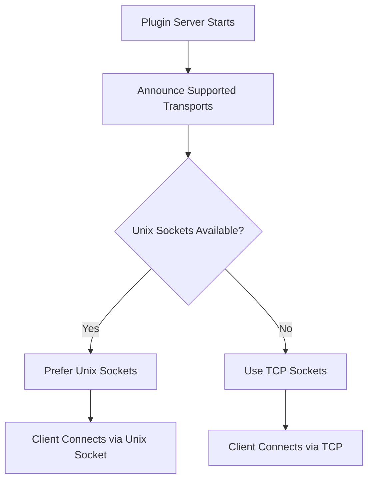

# Transport Layer

Understanding transport mechanisms is crucial for optimal plugin communication. Pyvider RPC Plugin supports two primary transport types, each optimized for different use cases.

## Transport Types

### 🔌 Unix Domain Sockets (UDS)

<div class="transport-badge unix">Recommended for local communication</div>

Unix Domain Sockets provide the highest performance for Inter-Process Communication (IPC) on the same machine.

**Advantages:**
- **Maximum Performance** - Bypasses network stack overhead
- **Lower Latency** - Direct kernel-to-kernel communication
- **File System Permissions** - Leverage OS security models
- **Resource Efficient** - Minimal CPU and memory overhead

**Limitations:**
- **Same Host Only** - Cannot communicate across network
- **Path Length Limits** - Some systems restrict socket path length
- **Platform Support** - Not available on Windows (yet)

**Best For:**
- High-performance local plugins
- Security-sensitive applications
- Resource-constrained environments
- Production systems with co-located processes

### 🌐 TCP Sockets

<div class="transport-badge tcp">Universal compatibility</div>

TCP sockets enable network communication, allowing plugins to run on different machines.

**Advantages:**
- **Network Communication** - Plugins can run on remote hosts
- **Universal Support** - Works on all platforms (Linux, macOS, Windows)
- **Standard Protocol** - Well-understood networking model
- **Firewall Friendly** - Standard port-based communication

**Limitations:**
- **Higher Overhead** - Network stack processing even for localhost
- **Port Management** - Requires available ports and conflict resolution
- **Security Considerations** - Network exposure requires additional security

**Best For:**
- Distributed plugin architectures
- Windows environments
- Cross-machine communication
- Development and testing scenarios

## Transport Selection

### Automatic Negotiation

Pyvider RPC Plugin automatically selects the best available transport:



### Configuration

Control transport selection through configuration:

```python
from pyvider.rpcplugin.config import rpcplugin_config

# View available transports
transports = rpcplugin_config.server_transports()
print(f"Available transports: {transports}")  # ['unix', 'tcp']

# Force specific transport
from pyvider.rpcplugin import configure

configure(transports=["tcp"])  # TCP only
configure(transports=["unix"])  # Unix only
configure(transports=["unix", "tcp"])  # Both, prefer unix
```

### Environment Variables

```bash
# Prefer TCP for development
export PYVIDER_RPC_SERVER_TRANSPORTS="tcp,unix"

# Unix only for production
export PYVIDER_RPC_SERVER_TRANSPORTS="unix"

# Custom TCP port
export PYVIDER_RPC_TCP_PORT="8080"

# Custom Unix socket path
export PYVIDER_RPC_UNIX_SOCKET_PATH="/tmp/my-plugin.sock"
```

## Implementation Details

### Unix Socket Transport

```python
from pyvider.rpcplugin.transport import UnixSocketTransport
import tempfile

# Create unix socket transport
with tempfile.NamedTemporaryFile(suffix=".sock", delete=False) as tmp:
    socket_path = tmp.name

transport = UnixSocketTransport(path=socket_path)

# Use with plugin server
server = plugin_server(protocol=my_protocol, handler=my_handler, transport=transport)
```

**Socket Path Management:**
- Automatic cleanup on server shutdown
- Collision detection and resolution
- Filesystem permission handling

### TCP Socket Transport

```python
from pyvider.rpcplugin.transport import TCPSocketTransport

# Create TCP transport
transport = TCPSocketTransport(host="127.0.0.1", port=0)  # port=0 for auto-assignment

# Use with plugin server
server = plugin_server(protocol=my_protocol, handler=my_handler, transport=transport)
```

**Port Management:**
- Automatic port assignment (port=0)
- Port collision detection
- Configurable host binding

## Platform Considerations

### Linux

All transport types fully supported:

```python
# Preferred configuration for Linux
configure(transports=["unix", "tcp"])  # Unix preferred, TCP fallback
```

### macOS

All transport types fully supported:

```python
# Preferred configuration for macOS  
configure(transports=["unix", "tcp"])  # Unix preferred, TCP fallback
```

### Windows

Unix sockets not yet supported:

```python
# Windows configuration
configure(transports=["tcp"])  # TCP only
```

!!! note "Windows Unix Socket Support"
    Windows 10+ supports Unix sockets, but Pyvider RPC Plugin doesn't yet leverage this. Support is planned for future releases using named pipes.

## Performance Characteristics

### Benchmark Results

| Transport | Throughput | Latency | CPU Usage | Memory |
|-----------|------------|---------|-----------|--------|
| Unix Socket | **~45,000 msg/sec** | **~0.02ms** | Low | Low |
| TCP (localhost) | ~35,000 msg/sec | ~0.03ms | Medium | Medium |
| TCP (network) | Varies by network | Varies by network | Medium | Medium |

### Optimization Tips

**For Unix Sockets:**
```python
# Use larger buffer sizes for high throughput
configure(unix_socket_buffer_size=65536)

# Optimize socket permissions
configure(unix_socket_permissions=0o600)
```

**For TCP Sockets:**
```python
# Use TCP_NODELAY for low latency
configure(tcp_nodelay=True)

# Optimize buffer sizes
configure(tcp_buffer_size=65536)

# Bind to specific interfaces in production
configure(tcp_host="192.168.1.100")
```

## Security Considerations

### Unix Socket Security

- **File Permissions** - Leverage filesystem ACLs
- **Path Location** - Use secure temporary directories
- **Cleanup** - Ensure socket files are removed on shutdown

```python
# Secure unix socket configuration
configure(
    unix_socket_path="/var/run/myapp/plugin.sock",
    unix_socket_permissions=0o600,  # Owner read/write only
    unix_socket_cleanup=True
)
```

### TCP Socket Security

- **Bind Address** - Use 127.0.0.1 for localhost only
- **Port Range** - Use non-privileged ports (>1024)
- **mTLS** - Enable mutual TLS for authentication

```python
# Secure TCP configuration
configure(
    tcp_host="127.0.0.1",  # Localhost only
    tcp_port_range=(8000, 9000),  # Specific port range
    auto_mtls=True  # Enable mTLS
)
```

## Common Patterns

### Development vs Production

**Development Configuration:**
```python
# Easy debugging and cross-platform compatibility
configure(
    transports=["tcp"],
    tcp_host="127.0.0.1",
    log_transport_details=True
)
```

**Production Configuration:**
```python
# Maximum performance and security
configure(
    transports=["unix"],
    unix_socket_path="/var/run/myapp/plugin.sock",
    unix_socket_permissions=0o600,
    auto_mtls=True
)
```

### Transport Fallback

```python
# Graceful degradation
configure(transports=["unix", "tcp"])  # Try unix first, fallback to TCP

# Handle transport failures
try:
    server = plugin_server(protocol=protocol, handler=handler)
    await server.serve()
except TransportError as e:
    logger.error(f"Transport failed: {e}")
    # Implement fallback strategy
```

## Troubleshooting

### Common Unix Socket Issues

**Permission Denied**
```bash
# Check socket file permissions
ls -la /path/to/socket.sock

# Fix permissions
chmod 600 /path/to/socket.sock
```

**Address Already in Use**
```bash
# Find processes using the socket
lsof /path/to/socket.sock

# Remove stale socket files
rm /path/to/socket.sock
```

### Common TCP Issues

**Port Already in Use**
```bash
# Find what's using the port
netstat -tulpn | grep :8080
lsof -i :8080

# Use automatic port assignment
configure(tcp_port=0)  # Let OS choose available port
```

**Connection Refused**
```bash
# Check if server is listening
netstat -tulpn | grep :8080

# Verify firewall settings
sudo ufw status
```

## What's Next?

Now that you understand transports:

- **[Security Model](security.md)** - Learn about mTLS and authentication
- **[Configuration](configuration.md)** - Explore all configuration options
- **[Server Development](../server/)** - Build production-ready servers
- **[Performance Tuning](../performance/)** - Optimize for your use case