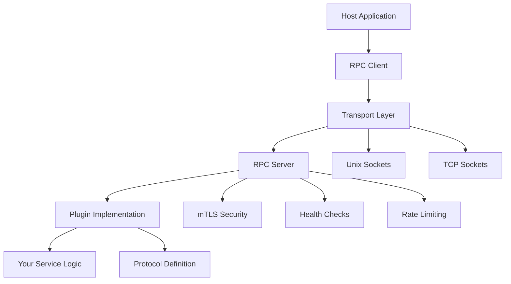

# Pyvider RPC Plugin**Enterprise-grade RPC plugin framework for Python applications**

Build high-performance, type-safe plugin systems with Foundation integration, security-first architecture, and modern async patterns. Pyvider RPC Plugin provides everything you need to create production-focused microservices and plugin ecosystems.

**Part of the [provide.foundation](https://foundation.provide.io) ecosystem** - seamlessly integrates with Foundation's configuration, logging, and development toolchain for consistent, unified application architecture.

---

## Part of the provide.io Ecosystem

This project is part of a larger ecosystem of tools for Python and Terraform development.

**[View Ecosystem Overview →](https://docs.provide.io/provide-foundation/ecosystem/)**

Understand how provide-foundation, pyvider, flavorpack, and other projects work together.

---

## ✨ Key Features

### ⚡ **Performance-First**

- **Async-native**: Full `asyncio` integration for maximum concurrency
- **Efficient transports**: Unix domain sockets for local IPC and TCP for network communication
- **Optimized serialization**: Protocol Buffers with streaming support
- **High throughput**: Designed for high-volume, low-latency plugin communication

### 🔒 **Security-Focused**

- **Built-in mTLS**: Mutual TLS authentication with certificate management utilities
- **Process isolation**: Plugins run as separate processes for enhanced stability
- **Transport encryption**: Secure communication over any network when mTLS is enabled
- **Magic cookie validation**: Handshake verification for trusted connections

### 🛠️ **Developer Experience**

- **Modern Python**: Python 3.11+ with native type annotations (`dict`, `list`, union operators)
- **Foundation ecosystem**: Unified configuration, logging, and toolchain with other Foundation projects
- **Factory functions**: `plugin_server()` and `plugin_client()` for rapid development
- **Rich error handling**: Detailed exceptions with contextual information and guidance

### 🏗️ **Production-focused**

- **Foundation configuration**: `PLUGIN_*` environment variables with validation and type safety
- **Structured logging**: Foundation's logging system with context preservation and filtering
- **Health checks**: gRPC Health Checking Protocol with custom status reporting
- **Rate limiting**: Token bucket implementation with per-client and global policies

## 🚀 Quick Start

### Installation

=== "uv" `bash     uv add pyvider-rpcplugin     `

### Your First Plugin

Create a complete echo service with modern Python patterns:

```python
import asyncio
from pyvider.rpcplugin import plugin_server, configure
from pyvider.rpcplugin.protocol.base import RPCPluginProtocol
from provide.foundation import logger

# Configure for your environment
# Note: configure() has 5 explicit parameters (magic_cookie, protocol_version, transports,
# auto_mtls, handshake_timeout) plus **kwargs for other settings.
# Via **kwargs, you can pass additional parameters which are automatically prefixed with 'plugin_'
configure(
    magic_cookie="my-echo-plugin",  # Explicit param: Sets PLUGIN_MAGIC_COOKIE_VALUE
    auto_mtls=False,                # Explicit param: Sets PLUGIN_AUTO_MTLS=False (disables mTLS for local dev; default is True)
    handshake_timeout=5.0           # Explicit param: Sets PLUGIN_HANDSHAKE_TIMEOUT
    # Additional settings can be passed via **kwargs:
    # log_level="DEBUG",            # Via **kwargs: Sets plugin_log_level
    # server_port=8080,             # Via **kwargs: Sets plugin_server_port
)

class EchoService:
    """Echo service with Foundation logging."""

    async def echo(self, message: str) -> str:
        # Foundation logger with structured context
        logger.info("Processing echo request", extra={
            "message": message,
            "service": "echo"
        })
        return f"Echo: {message}"

class EchoProtocol(RPCPluginProtocol):
    """Protocol implementation for echo service."""

    async def get_grpc_descriptors(self) -> tuple[object, str]:
        import echo_pb2_grpc
        return echo_pb2_grpc, "echo.EchoService"

    async def add_to_server(self, server: object, handler: object) -> None:
        from echo_pb2_grpc import add_EchoServiceServicer_to_server
        add_EchoServiceServicer_to_server(handler, server)

async def main() -> None:
    """Launch the echo plugin server."""
    server = plugin_server(
        protocol=EchoProtocol(),
        handler=EchoService()
    )
    await server.serve()

if __name__ == "__main__":
    asyncio.run(main())
```

Connect from a client with automatic plugin management:

```python
import asyncio
import sys
from pathlib import Path
from pyvider.rpcplugin import plugin_client, configure
from provide.foundation import logger

# Configure client environment
# Note: configure() has explicit parameters plus **kwargs for additional settings
configure(
    magic_cookie="my-echo-plugin",  # Explicit param: Must match server's magic cookie
    handshake_timeout=10.0,          # Explicit param: Sets PLUGIN_HANDSHAKE_TIMEOUT
)

async def main() -> None:
    """Client automatically launches and manages plugin process."""
    # Plugin command - client handles process lifecycle
    plugin_path = Path(__file__).parent / "echo_server.py"
    plugin_command = [sys.executable, str(plugin_path)]

    # Use async context manager for automatic cleanup
    async with plugin_client(command=plugin_command) as client:
        # Start the plugin
        await client.start()

        # Use typed gRPC stub
        from echo_pb2_grpc import EchoServiceStub
        from echo_pb2 import EchoRequest

        stub = EchoServiceStub(client.grpc_channel)
        request = EchoRequest(message="Hello, Foundation!")

        response = await stub.Echo(request)
        logger.info("Plugin response received", extra={
            "request_message": request.message,
            "response_reply": response.reply,
            "client_id": "echo-client"
        })
    # Client automatically closed on context exit

if __name__ == "__main__":
    asyncio.run(main())
```

## 🏛️ Architecture Overview

Pyvider RPC Plugin follows a clean architecture pattern:



### Core Components

- **🚀 Server**: High-performance async gRPC server with security and monitoring
- **📱 Client**: Type-safe client with connection management and retry logic
- **🌐 Transports**: Unix domain sockets and TCP with automatic transport negotiation
- **📋 Protocols**: gRPC-based protocols with Protocol Buffer serialization
- **🔐 Security**: mTLS encryption, certificate management, and process isolation
- **⚙️ Configuration**: Foundation-based config with environment variable support

## 📚 Documentation Structure

<div class="grid cards" markdown>

- :material-rocket-launch: **Getting Started**

    ---
    
    Quick installation, setup guide, and your first plugin
    
    [:octicons-arrow-right-24: Get Started](getting-started/index/)

  Quick installation, setup guide, and your first plugin

    ---
    
    Comprehensive guide covering concepts, server/client development, and advanced topics
    
    [:octicons-arrow-right-24: User Guide](guide/index/)

- :material-book-open: **User Guide**

    ---
    
    Complete API documentation with examples and code snippets
    
    [:octicons-arrow-right-24: API Reference](reference/index/)

  Comprehensive guide covering concepts, server/client development, and advanced topics

    ---
    
    Working examples from simple echo services to production deployments
    
    [:octicons-arrow-right-24: Examples](examples/index/)

</div>

## 🌟 Why Choose Pyvider RPC Plugin?

### **Foundation Ecosystem Integration**

- 🏗️ **Unified architecture** with Foundation's configuration, logging, and development patterns
- ⚙️ **Consistent toolchain** across all provide.io projects and services
- 📊 **Structured observability** with Foundation's logging and metrics integration
- 🔄 **Seamless interoperability** with other Foundation-based applications

### **vs. Native gRPC**

- 🚀 **Plugin-first design** with automatic process management and handshaking
- 🔐 **Security by default** with mTLS, certificate management, and magic cookie validation
- ⚙️ **Foundation configuration** with `PLUGIN_*` environment variables and validation
- 🛠️ **Factory functions** eliminate boilerplate while maintaining flexibility

### **vs. HashiCorp go-plugin**

- 🐍 **Native Python** with modern async/await and Python 3.11+ features
- 📈 **Superior performance** with optimized Protocol Buffers and transport negotiation
- 🎯 **Full type safety** with comprehensive annotations and validation
- 🔗 **Foundation ecosystem** provides consistent patterns across microservices

### **vs. Custom RPC Solutions**

- ⚡ **Accelerated development** with battle-tested infrastructure and patterns
- 🛡️ **Production-focused security** with mTLS, process isolation, and rate limiting
- 📚 **Comprehensive tooling** for configuration, logging, health checks, and testing
- 🏢 **Enterprise support** with Foundation's ecosystem and community

## 🚦 Next Steps

**Choose your path based on your experience with Foundation and plugin systems:**

[**Start Building** - Installation & Quick Start :material-arrow-right:](getting-started/installation/){ .md-button .md-button--primary }

[**Deep Dive** - Architecture & Concepts :material-arrow-right:](guide/concepts/rpc-architecture/){ .md-button }

**Foundation Users:** See [Foundation Integration](introduction/foundation/) for seamless ecosystem integration.