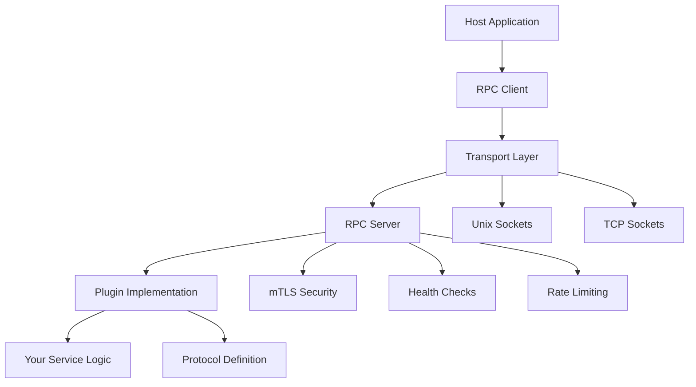

# Welcome to Pyvider RPC Plugin

**`pyvider.rpcplugin`** is a high-performance, type-safe RPC plugin framework for Python with built-in security, async support, and production-ready patterns. Perfect for microservices, plugin architectures, and inter-process communication.

Built on industry-standard protocols like gRPC and Protocol Buffers, pyvider.rpcplugin offers enterprise-grade plugin development with beautiful Foundation-powered logging, comprehensive error handling, and cross-platform transport support.

## ✨ Key Features

### ⚡ **Performance-First**
- **Async-native**: Full `asyncio` integration for maximum concurrency
- **Efficient transports**: Unix domain sockets for local IPC and TCP for network communication  
- **Optimized serialization**: Protocol Buffers with streaming support
- **High throughput**: Designed for high-volume, low-latency plugin communication

### 🔒 **Security-Focused** 
- **Built-in mTLS**: Mutual TLS authentication with certificate management utilities
- **Process isolation**: Plugins run as separate processes for enhanced stability
- **Transport encryption**: Secure communication over any network when mTLS is enabled
- **Magic cookie validation**: Handshake verification for trusted connections

### 🛠️ **Developer Experience**
- **Modern Python**: Leverages Python 3.11+ features with complete type annotations
- **Foundation integration**: Built on [provide.foundation](https://foundation.provide.io) for consistent tooling
- **Factory functions**: Simplified APIs for common plugin server and client setup
- **Rich error handling**: Detailed exceptions with contextual information and guidance

### 🏗️ **Production Ready**
- **Robust configuration**: Environment variables, file-based config, and programmatic setup
- **Comprehensive logging**: Integrated with Foundation's structured logging system
- **Health checks**: Built-in health monitoring with gRPC Health Checking Protocol
- **Rate limiting**: Token bucket rate limiting with configurable policies

## 🚀 Quick Start

### Installation

=== "pip"
    ```bash
    pip install pyvider-rpcplugin
    ```

=== "uv"  
    ```bash
    uv add pyvider-rpcplugin
    ```

=== "poetry"
    ```bash  
    poetry add pyvider-rpcplugin
    ```

### Your First Plugin

Create a simple echo plugin server:

```python
import asyncio
from pyvider.rpcplugin import plugin_server
from pyvider.rpcplugin.protocol.base import RPCPluginProtocol
from provide.foundation import logger

# Define your service
class EchoService:
    async def echo(self, message: str) -> str:
        logger.info(f"📨 Received message: {message}")
        return f"Echo: {message}"

# Create protocol implementation
class EchoProtocol(RPCPluginProtocol):
    async def get_grpc_descriptors(self):
        # Implementation details...
        pass
    
    async def add_to_server(self, server, handler):
        # Add your service to the gRPC server
        pass

# Launch the plugin server
async def main():
    server = await plugin_server(
        protocol=EchoProtocol(),
        handler=EchoService()
    )
    await server.serve()

if __name__ == "__main__":
    asyncio.run(main())
```

Connect from a client:

```python
import asyncio
from pyvider.rpcplugin import plugin_client

async def main():
    async with plugin_client() as client:
        # Use your plugin client
        response = await client.call_method("echo", message="Hello, Plugin!")
        print(f"Response: {response}")

if __name__ == "__main__":
    asyncio.run(main())
```

## 🏛️ Architecture Overview

Pyvider RPC Plugin follows a clean architecture pattern:



### Core Components

- **🚀 Server**: High-performance async gRPC server with security and monitoring
- **📱 Client**: Type-safe client with connection management and retry logic  
- **🌐 Transports**: Unix domain sockets and TCP with automatic transport negotiation
- **📋 Protocols**: gRPC-based protocols with Protocol Buffer serialization
- **🔐 Security**: mTLS encryption, certificate management, and process isolation
- **⚙️ Configuration**: Foundation-based config with environment variable support

## 📚 Documentation Structure

<div class="grid cards" markdown>

-   :material-rocket-launch: **Getting Started**

    ---
    
    Quick installation, setup guide, and your first plugin
    
    [:octicons-arrow-right-24: Get Started](getting-started/)

-   :material-book-open: **User Guide**

    ---
    
    Comprehensive guide covering concepts, server/client development, and advanced topics
    
    [:octicons-arrow-right-24: User Guide](guide/)

-   :material-api: **API Reference**

    ---
    
    Complete API documentation with examples and code snippets
    
    [:octicons-arrow-right-24: API Reference](api/)

-   :material-code-braces: **Examples**

    ---
    
    Working examples from simple echo services to production deployments
    
    [:octicons-arrow-right-24: Examples](examples/)

</div>

## 🌟 Why Choose Pyvider RPC Plugin?

### **vs. Native gRPC**
- 🔧 **Simplified setup** with factory functions and automatic configuration
- 🔐 **Built-in security** with mTLS and certificate management
- 📊 **Integrated monitoring** with health checks and structured logging  
- 🚀 **Production patterns** like rate limiting and retry logic included

### **vs. HashiCorp go-plugin**
- 🐍 **Native Python** implementation with async/await support  
- 📈 **Better performance** with Protocol Buffers and efficient transports
- 🎯 **Type safety** with comprehensive type annotations
- 🔗 **Foundation integration** for consistent tooling across the provide.io ecosystem

### **vs. Custom RPC Solutions**  
- ⚡ **Faster development** with pre-built server/client infrastructure
- 🛡️ **Security by default** with mTLS and process isolation
- 🔧 **Standardized patterns** for configuration, logging, and error handling
- 📚 **Comprehensive documentation** with working examples

## 🚦 Next Steps

Ready to build your first plugin? Start with our step-by-step guide:

[Get Started with Installation :material-arrow-right:](getting-started/installation.md){ .md-button .md-button--primary }

Or dive deeper into the concepts:

[Explore the Architecture :material-arrow-right:](guide/concepts/rpc-architecture.md){ .md-button }